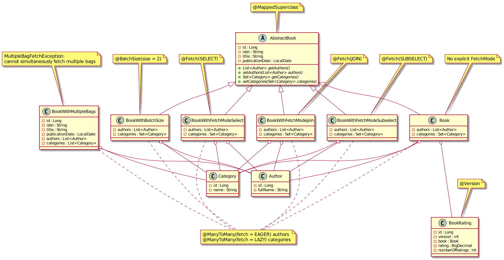

# Spring Data JPA pitfalls and modern alternatives: Spring Data JDBC and Spring Data R2DBC

- [Overview](#3b878279a04dc47d60932cb294d96259)
- [Spring Data JPA](#810bf4be9fd3907b3e5cff790716a958)
  - [Fetching strategies](#75e0f07fedd63771fc35ec852a9c937f)
  - [Locking strategies](#9a3347442ef97064c198bda69c16f816)
  - [Primary key generation](#4913ac92d5278259d9ed6f5a54ca4200)
  - [Entity to DTO mapping](#6066f586527da9c5d0e297396ca12e5e)
- [Spring Data JDBC](#86e43ec88f085c89356cfb650c7d5ce7)
- [Spring Data R2DBC](#afa7b6461a2e3f16a1895d95522f3f29)
- [Conclusion](#6f8b794f3246b0c1e1780bb4d4d5dc53)
- [Spring Data JPA example](#e930cfb2216d9b0871311eeabd12ef12)
  - [Test data](#ca1ea02c10b7c37f425b9b7dd86d5e11)
  - [Fetching strategies](#75e0f07fedd63771fc35ec852a9c937f)
    - [Entity without explicit `@Fetch`](#7ea24578e6c11808b7b2880dd98bc573)
      - [`CrudRepository.findById`](#4a2070d3aad7ff832b5e36f76cc6f731)
      - [Query method](#ecfc45d33505baec3249b78ec3e66059)
      - [Query method with `@EntityGraph`](#957184c667a66fa2409d3c81d58e0f90)
      - [Query method with `@EntityGraph` and `Pageable`](#ce895104ae9e9dd02aafbba89a339104)
      - [Query method with `@EntityGraph` with multiple attribute nodes (issue HHH-13740)](#260b142dfcc1f303ff3e67de6da4d730)
      - [`@Query` with JPQL `join fetch`](#99fac513c058317164ad5a6e20d34f18)
      - [`@Query` with JPQL `join fetch` and `distinct`](#ff9705f518ec48b7fa77d2d6cd0c3c14)
      - [Custom `@Repository` with Criteria API query](#e11be536b6f6d686f69f20513138cae0)
      - [Custom `@Repository` with Criteria API query with `fetch`](#1323d64c9e1914e06c3b257f7cea728c)
      - [Custom `@Repository` with Criteria API query with `fetch` and `distinct`](#7285e9899741d937830c2225ff8d01bc)
    - [Entity with `@Fetch(JOIN)`](#239f2f55854878f99d5d4d379a765d39)
      - [`CrudRepository.findById`](#4a2070d3aad7ff832b5e36f76cc6f731)
      - [Query method](#ecfc45d33505baec3249b78ec3e66059)
    - [Entity with `@Fetch(SELECT)`](#61d561e02c4002d6d6ad4646e5d328f7)
      - [`CrudRepository.findById`](#4a2070d3aad7ff832b5e36f76cc6f731)
      - [Query method](#ecfc45d33505baec3249b78ec3e66059)
    - [Entity with `@Fetch(SUBSELECT)`](#76b5b36ea931f6c209971594a5473ffa)
      - [`CrudRepository.findById`](#4a2070d3aad7ff832b5e36f76cc6f731)
      - [Query method](#ecfc45d33505baec3249b78ec3e66059)
    - [Entity with `@BatchSize`](#b77feec501b1fe41ebee44d25e206880)
      - [`CrudRepository.findById`](#4a2070d3aad7ff832b5e36f76cc6f731)
      - [Query method](#ecfc45d33505baec3249b78ec3e66059)
    - [Entity with multiple bags resulting in `MultipleBagFetchException`](#1049387d75c060dc77f67c5477fb48d4)
  - [Locking strategies](#9a3347442ef97064c198bda69c16f816)
    - [Implicit optimistic lock of entity with `@Version` on modification](#272ede57357a5f214f2904c15e3fe103)
    - [Explicit optimistic lock `@Lock(OPTIMISTIC)`](#502c2256dbc0a223143500d9f9b3b5cc)
    - [Explicit optimistic lock `@Lock(OPTIMISTIC_FORCE_INCREMENT)`](#6efaef54090120ae008692898745a547)
    - [Explicit pessimistic write lock `@Lock(PESSIMISTIC_WRITE)`](#c2b4e4a7c69f6c6b216e05a547731c57)
    - [Explicit pessimistic read lock `@Lock(PESSIMISTIC_READ)`](#657a4b524b13a122706ee27f7675bcf7)
  - [Mapping from entity to DTO using MapStruct](#532d5a8c2809912b992aa517d1e46ced)
- [Spring Data JDBC example](#1ef62fd469285970a640c75be1cbdb9a)
  - [Test data](#ca1ea02c10b7c37f425b9b7dd86d5e11)
  - [Queries](#cf43137803fb51915f84cbc5c3068d34)
    - [`CrudRepository.save`](#07109b7f3df585c23975718b13843dac)
    - [`CrudRepository.findById`](#4a2070d3aad7ff832b5e36f76cc6f731)
    - [`PagingAndSortingRepository.findAll(Pageable)`](#f34c8b22bd6fb5a16c60b7ecd412d675)
    - [`@Query` with SQL](#fe9f09d7c10598e080ef1ac1502711df)
    - [`@Query` with SQL join](#ce75f4a17b574599267b2a18924cb931)
    - [`@Query` with SQL and pagination](#59581bf130250c31253eac07da3d2c56)
  - [Locking strategies](#9a3347442ef97064c198bda69c16f816)
    - [Implicit optimistic lock of entity with `@Version` on modification](#272ede57357a5f214f2904c15e3fe103)
  - [Mapping from entity to DTO using MapStruct](#532d5a8c2809912b992aa517d1e46ced)
  - [Reactive `Mono.fromCallable` wrapping synchronous call](#fc1290b67d538903eba761ca9f952dc9)
- [Spring Data R2DBC example](#1418b03e9a73d96a8c697855b6c0401e)
  - [Queries](#cf43137803fb51915f84cbc5c3068d34)
    - [`CrudRepository.findById`](#4a2070d3aad7ff832b5e36f76cc6f731)
    - [Query method with `Sort`](#74790cb9ca9d56e09b465befb7c7603b)
    - [`@Query` with SQL and pagination](#59581bf130250c31253eac07da3d2c56)
    - [Mapping from entity to DTO using MapStruct](#532d5a8c2809912b992aa517d1e46ced)

<!-- Table of contents is made with https://github.com/evgeniy-khist/markdown-toc -->

## <a id="3b878279a04dc47d60932cb294d96259"></a>Overview

These examples demonstrates some common JPA pitfalls and evaluates alternatives from the Spring Data family:
* [spring-data-jpa-examples](spring-data-jpa-examples/) - some of common JPA pitfalls
* [spring-data-jdbc-examples](spring-data-jdbc-examples/) - Spring Data JDBC as a simpler alternative inspired by Domain-Driven Design
* [spring-data-r2dbc-examples](spring-data-r2dbc-examples/) - Spring Data R2DBC for reactive database connectivity

[Spring Data](https://spring.io/projects/spring-data) is a family of libraries aiming to simplify the implementation of a data access layer for Spring-based applications by reducing boilerplate code. 
Spring Data makes it easy to implement a Repository for accessing persistent entities in the underlying data store.
Spring Data JPA allows building repositories based on JPA.

JPA (Java Persistence API) is an API specification that defines an ORM (object-relational mapping) standard for Java applications.
JPA 1.0 was released in 2006, and the last version is JPA 2.2.
The JPA was renamed as Jakarta Persistence in 2019 and version 3.0 was released in 2020. 
[Jakarta Persistence 3.0](https://jakarta.ee/specifications/persistence/3.0/) didn’t introduce any new features, the only change is the renaming of packages and properties from `javax.persistence` to `jakarta.persistence`.

The most popular JPA/Jakarta Persistence vendor is [Hibernate](https://hibernate.org/) ORM.
Hibernate supports JPA 2.2 since the 5.3 series and Jakarta Persistence 3.0 since 5.5 series.

JPA and Hibernate are de facto a standard way of implementing a data access layer in Java applications.

All these years JPA and Hibernate are criticized for being too complicated.
Trying to operate with database records like with objects and completely hide the relational nature of a database, 
JPA introduces some complexity: 
detaching and merging entities, first-level cache, lazy loading, dirty checking, and many other features. 
More importantly, in the JPA, many DB calls are made behind the scenes.
A simple query sometimes leads to multiple SQL queries to a DB.
In its turn, too many SQL queries leads to performance problems.

## <a id="810bf4be9fd3907b3e5cff790716a958"></a>Spring Data JPA

[Spring Data JPA](https://spring.io/projects/spring-data-jpa) allows writing less boilerplate code, but JPA and Hibernate still have many pitfalls.
The ones described in this example, I consider the most common pitfalls.

Thus, [spring-data-jpa-examples](spring-data-jpa-examples/) demonstrate and analyze the following JPA-related topics:
* fetching strategies of `@OneToMany` and `@ManyToMany` collections
* locking strategies
* entity to DTO mapping

Spring Framework 5.3.x line and Spring Boot 2.6.x line still use JPA 2.2.
Spring Framework 6 and Spring Boot 3 with Jakarta Persistence 3.0 support (as a part of Jakarta EE 9 compatibility) are planned for general availability in Q4 2022.

### <a id="75e0f07fedd63771fc35ec852a9c937f"></a>Fetching strategies

An entity can reference others called child entities.
When fetching an entity, should Hibernate also fetch child entities? 
How to fetch child entities, in a separate query, or the same query by joining related tables etc.?

JPA and Hibernate have different fetch types, fetch modes.
Some of them can cause problems if used improperly.

One-to-many and many-to-many relationships are mapped to fields of a class of types `List` and `Set` 
annotated with JPA annotations `@OneToMany` or `@ManyToMany`.
These annotations have parameter `fetch` of type `javax.persistence.FetchType`/`jakarta.persistence.FetchType`.

There are also Hibernate-specific annotation `@Fetch` with parameter `value` of type `org.hibernate.annotations.FetchMode` and `@BatchSize` that define how a child entity fetching is done.

`javax.persistence.FetchType`/`jakarta.persistence.FetchType` defines **when** the fetching is done 
while `org.hibernate.annotations.FetchMode` focuses on **how**.

There are 2 `FetchType` values:
* `EAGER` - load a child entity at the same time when the parent entity is loaded but not necessarily in a single SQL query. 
* `LAZY` - postpone a child entity loading and fetch on the first access. So, if a field was never accessed, 
    it's not fetched at all.

Be default, Hibernate lazily loads child collections (`@OneToMany` and `@ManyToMany`).
This is optimal for the majority of cases.

There are 3 `FetchMode` values:
* `SELECT` - fetch each child collection using an additional `SELECT` SQL query per parent entity. 
    If a query returns N entities with 2 child collections, together with the main query, 
    there will be 1 + N * 2 `SELECT` queries in total.
* `JOIN` - fetch in a single query together with a parent entity using SQL `JOIN`. 
    Joining a parent entity with child collections results in duplicates in the query result set.
* `SUBSELECT` - fetch each child collection for all parent entities in a single SQL query. 
    If a query returns N entities with 2 child collections, together with the main query, 
    there will be 3 (1 + 2) `SELECT` queries.

If a field is not annotated with `@Fetch`, then the default `FetchMode` for this field depends on a `FetchType` and how the query is done:
* `FetchType.LAZY` - `FetchMode.SELECT`
* `FetchType.EAGER`:
  * getting by ID - `FetchMode.JOIN`
  * JPQL query - `FetchMode.SELECT` 
  * Criteria API query - `FetchMode.SELECT`

`@BatchSize` annotation defines size for batch loading of child collections.  
If a query returns N entities with 2 child collections, together with the main query, 
there will be 1 + ceil(N / batchSize) * 2 `SELECT` queries in total.
Child collection for the first 2 parent entities are loaded in the first query, for the next 2 parent entities in second query etc.

Why do we need so many options to control the fetching of child collections?
Why can't we always use `FetchMode.SELECT`? 

It is related to so called "N+1 selects" problem.
When `FetchMode.SELECT` is used, Hibernate fetches associated collections using a separate SQL `SELECT` query.
The first SQL query selects parent (root) entities only.
Each associated collection is loaded with a separate SQL query.
Thus, Hibernate makes N+1 SQL queries, where N is the number of parent (root) entities in the result set.

Solutions to "N+1 selects" problem:
* `FetchMode.JOIN` 
* `FetchMode.SUBSELECT` 
* `@BatchSize`
* `@EntityGraph`
* JPQL `join fetch`
* Criteria API `fetch`

`FetchMode.JOIN` has no effect on JPQL queries. 
So, use it to get entity by ID (`CrudRepository.findById`).
Be ready to handle duplicates in the result set due to joining a parent entity table with child collection table.

`FetchMode.SUBSELECT` makes Hibernate fetch all child entities for all parent entities from the result set using a single SQL query with original query as sub-select:
```sql
SELECT * FROM Parent
SELECT * FROM Child WHERE parentId IN (SELECT id FROM Parent)
```
But there is a pitfall. 
If a query has pagination (offset and limit), Hibernate doesn't include it in the sub-select:
```sql
SELECT * FROM Parent LIMIT 2
SELECT * FROM Child WHERE parentId IN (SELECT id FROM Parent)
```
It may result in loading all child entities (depending on the data set even millions) into the memory even if only few of them are required.
It can consume a lot of memory what is unexpected.

`@BatchSize` is a compromise between `FetchMode.SELECT` and `FetchMode.SUBSELECT`.
With `@BatchSize(size = batchSize)` Hibernate generates (1 + ceil(N / batchSize)).
With a result set of size 2 and `@BatchSize(size = 2)`, 3 queries are executed.
```sql
SELECT * FROM Parent LIMIT 2
SELECT * FROM Child WHERE parentId IN (?, ?)
SELECT * FROM Child WHERE parentId IN (?, ?)
...
```
Increasing batch size adds more values to the `IN` clause.
Remember that Oracle database has limitation of 1000 items in `IN` clause.
So, `@BatchSize` looks like the most safe solution for generic cases.

Find out more details in the [example](#e930cfb2216d9b0871311eeabd12ef12).

### <a id="9a3347442ef97064c198bda69c16f816"></a>Locking strategies

Locks are mechanisms that prevent destructive interaction between transactions accessing the same resource.

A transaction always gets an exclusive lock on any data it modifies and holds that lock until the transaction completes, 
regardless of the [isolation level](https://en.wikipedia.org/wiki/Isolation_(database_systems)) set for the transaction.

Read committed is a default isolation for most JDBC drivers.

For read operations transaction isolation levels primarily define the level of protection from the effects of modification made by other transactions.
In read committed reads are not blocking.

Exclusive lock on a record can be acquired using:
* `UPDATE tbl SET col1 = 'new value'` 
* `SELECT col1 FROM tbl FOR UPDATE`

Shared lock on a record in PostgreSQL can be acquired using:
* `SELECT col1 FROM tbl FOR SHARE`

Records locked with `SELECT FOR UPDATE` are protected from modifications by other transactions.
Transactions trying to `UPDATE`, `DELETE`, `SELECT FOR UPDATE`, `SELECT FOR SHARE` are locked, 
until the end of the current transaction.

Records locked with `SELECT FOR SHARE` are protected from `UPDATE`, `DELETE`, `SELECT FOR UPDATE` from other transactions 
but `SELECT FOR SHARE` is allowed.

There are pessimistic and optimistic locking concurrency control mechanisms.

Pessimistic locking is a strategy when you lock a record when reading and then modify:
```sql
SELECT col1 FROM tbl FOR UPDATE;
...
UPDATE tbl SET col1 = 'new value';
```

Optimistic locking is a strategy when you read record with version number and then check this version for updating:
```sql
SELECT col1, version FROM tbl;
...
UPDATE tbl SET col1 = 'new value', version = version + 1 WHERE version = :version;
```
Table should have column to store version. 
Update of the row is done with version checking. 
If row version has already changed in other transaction, changes of current transaction are discarded and whole transaction should be repeated.


If version check is optimistic locking fails, read and update queries should be re-executed.

Pessimistic locking prevents lost updates and makes updates serial (FIFO) reducing throughput.
Optimistic locking just prevents lost updates.

Optimistic locking allows reducing the time the lock is held and sometimes increases throughput.

If an entity has a field annotated with `@Version`, optimistic locking is enabled by default if the entity was modified, even without explicitly specifying `LockModeType`.
But if the entity was not modified, there will be no version check before transaction commit. 

JPA has the following `javax.persistence.LockModeType`/`jakarta.persistence.LockModeType` values:
* `OPTIMISTIC` - if an entity was not modified, and a version check can't be done in an `UPDATE`, it is still done before a transaction commit using a simple `SELECT version FROM tbl`
* `OPTIMISTIC_FORCE_INCREMENT` - a version is incremented using an `UPDATE tlb SET version = version + 1` even if an entity was not modified
* `PESSIMISTIC_WRITE` - a record is locked using a `SELECT FOR UPDATE`
* `PESSIMISTIC_READ` - a record is locked using a `SELECT FOR SHARE` in PostgreSQL and `SELECT FOR UPDATE` in databases without shared row-level locks

`LockModeType.OPTIMISTIC` has a pitfall. If locked entity was not changed, Hibernate just checks version using simple `SELECT`.
If version was changed by another committed transaction, an `OptimisticLockException` exception is raised.
But between `SELECT` doing version check, and a commit of the current transaction there is a small time gap.
There is a risk that during this time another transaction still can change this entity.

Find out more details in the [example](#e930cfb2216d9b0871311eeabd12ef12).

### <a id="4913ac92d5278259d9ed6f5a54ca4200"></a>Primary key generation

generating unique keys for use in a database as a primary key
https://en.wikipedia.org/wiki/Hi/Lo_algorithm


### <a id="6066f586527da9c5d0e297396ca12e5e"></a>Entity to DTO mapping

Exposing JPA entities in a REST API can cause problems.
Instead, map entities to DTOs and expose them.

What is the difference between an entity and a DTO?

A JPA entity (`@Entity`) is persisted and has to correspond to the underlying database table structure.
JPA doesn't enforce modelling entities as Aggregates described in the book Domain-driven design (DDD) by Eric Evans.
Anyway, JPA entity is a part of a business domain with a structure influenced by the underlying DB schema.

A DTO is used to transfer data from a supplier to a consumer.
A structure of DTO is dictated by the consumer.
DTO contains fields the consumer needs.  
DTO can have data duplication (denormalized) what is usually avoided in entities (normalization).
A single DTO can be composed of multiple entities or can be very similar to an entity.

So, it is clear, that if our REST API response need to be composed of multiple entities, 
we need to use DTOs. 
But do we need DTOs if our REST API response is similar or even identical to the JPA entity structure?

Yes, we need DTOs even if initially the JPA entity and DTO fields are identical because:
* entity can have bidirectional associations leading to cycles in object graphs (a workaround is `@JsonIgnore`) 
* `LazyInitializationException` when serializing associations with `FetchType.LAZY`
* there's 99% chance that entity or DTO structure will change and become not identical

JDK 14 introduces [records](https://docs.oracle.com/en/java/javase/14/language/records.html), which are a new kind of 
type declaration. Like an `enum`, a record is a restricted form of a class. It’s ideal for DTOs.

To simplify entity to DTO mapping I recommend [MapStruct](https://mapstruct.org/) library.
Unlike most others bean mapping tools, MapStruct doesn't work at runtime but is a compile-time code generator.
It generates the mapper class at the compilation time.

Find out more details in the [example](#e930cfb2216d9b0871311eeabd12ef12).

## <a id="86e43ec88f085c89356cfb650c7d5ce7"></a>Spring Data JDBC

In the previous section we've found out that JPA and Hibernate has a lot of pitfalls and is complicated.

Are there an alternative to Spring Data JPA?
Yes. There is Spring Data JDBC. The latest (at the time of writing) version is 2.0.0.RC1.

Is it a full-fledged replacement of Spring Data JPA? 
Let's try to figure it out.

Spring Data JDBC is inspired by Aggregate Roots and Repositories as described in the book Domain-driven design (DDD) by Eric Evans.
Aggregate Root is an entity that controls the lifecycle of related entities forming together an Aggregate.
Each Aggregate has only one Aggregate Root. 
You should have a Repository per Aggregate Root.
Related entities (one-to-one and one-to-many relationships) doesn't exist alone without an Aggregate Root.
When an Aggregate Root is deleted, all related entities get deleted too.

If two entities have different life-cycles these are separate Aggregate Roots.
Thus, in contrast to JPA, one-to-many (between different Aggregates) and many-to-many relationships must be modeled by referencing the ID  
and join tables for many-to-many relationships must be mapped to a Java class and added to an Aggregate.

Spring Data JDBC enforces us to model entities like Aggregates.
Also, entities can be truly immutable Java classes what is hard to achieve with JPA.

Spring Data JDBC has only one strategy for fetching child entities.
Separate queries are generated for child collections (maps, lists, sets and arrays of entities).

Comparing with Hibernate, Spring Data JDBC has fetching strategy `FetchType.EAGER` and `FetchMode.SELECT`.
Lazy loading of child collections is not supported.
Also, there is no sense in joining parent and child entities tables in SQL query.
It produces duplicates in the result set while Spring Data JDBC still makes additional queries for child collections.

So, Spring Data JDBC is also subject to "N+1 selects" problem.

Spring Data JDBC supports optimistic locking by using `org.springframework.data.annotation.Version` annotation.
The behaviour is similar to JPA with `javax.persistence.Version`/`jakarta.persistence.Version` annotation.

Spring Data JDBC still misses some useful features like pagination for custom queries.

Nowadays reactive, non-blocking, event-driven applications is a trend.
Spring WebFlux is reactive and uses non-blocking I/O in contrast to Spring MVC that is based on Servlet API and uses traditional blocking I/O.
A fully reactive application has better throughput (but not the latency) in most cases,
and utilizes resources more efficiently, resulting in a smaller memory footprint for handling concurrent requests.
If the entire application is reactive and based on non-blocking I/O from the database to REST API, 
the performance might be better.

Is it possible to use Spring Data JDBC with Spring WebFlux?
Spring Data JDBC doesn't support `org.springframework.data.repository.reactive.ReactiveCrudRepository` directly.
To get reactive types `reactor.core.publisher.Mono` and `reactor.core.publisher.Flux`, 
a blocking JDBC calls should be wrapped:

```java
Mono<Book> blockingWrapper = Mono.fromCallable(() ->
        entityRepository.findById(1).orElse(null))
        .subscribeOn(Schedulers.boundedElastic());
```

Find out more details in the example.

## <a id="afa7b6461a2e3f16a1895d95522f3f29"></a>Spring Data R2DBC

Spring Data JDBC is simpler than JPA/Jakarta Persistence and has fewer pitfalls.
But it would be good to have a truly reactive non-blocking data access layer.
That's where Spring Data R2DBC comes in.
The latest (at the time of writing) version is Spring Data R2DBC 1.1.0.RC1.

Spring Data R2DBC uses Reactive Relational Database Connectivity, a reactive programming APIs to relational databases.
In contrast to the blocking nature of JDBC, R2DBC is non-blocking and has a reactive API.
R2DBC drivers are available for the most popular databases.

Spring Data R2DBC used together with Spring WebFlux allow developing fully-reactive and non-blocking applications.

Spring Data R2DBC concept is to be a simple and easy to use object mapper and 
does **NOT** provide many features of ORM.

One-to-one, one-to-many and many-to-many relationships are not supported.

Thus, in contrast to JPA, relationships must be modeled by referencing the ID 
and join tables for many-to-many relationships must be mapped to a Java class.

Spring Data R2DBC is raw and lack a lot of features. For example:
* [R2DBC ORM Relationships Support](https://github.com/spring-projects/spring-data-r2dbc/issues/99)
* [https://github.com/spring-projects/spring-framework/issues/24226](https://github.com/spring-projects/spring-framework/issues/24226)
* Implicit pagination with `org.springframework.data.domain.Pageable` is not supported

Fetching associations and mapping to DTO are not easy tasks with Spring Data R2DBC.

Find out more details in the example.

## <a id="6f8b794f3246b0c1e1780bb4d4d5dc53"></a>Conclusion

Spring Data JPA dramatically reduces the amount of boilerplate code.
Anyway, JPA and Hibernate have a lot of pitfalls developers should be aware of.
Developers have a little control over SQL queries that Hibernate generates.
The result is "N+1 selects" problem or loading the whole database table into the memory.

Spring Data JDBC is a simpler alternative. It gives developers more control over SQL queries.
But it lacks a lot of features like implicit pagination and also is a subject to "N+1 selects problem".
Spring Data JDBC is a good choice for a simple applications with a simple domain model.

Spring Data R2DBC is in active development and misses a lot of features but looks very promising.
The idea to have an entirely reactive Java application based on non-blocking I/O from the database to REST API, is very interesting.

So, in Spring Data family there is no production-ready alternative to Spring Data JPA for enterprise applications nowadays.

## <a id="e930cfb2216d9b0871311eeabd12ef12"></a>Spring Data JPA example

[spring-data-jpa-examples](spring-data-jpa-examples/) has a simple domain model. 
A book has at least one author and belongs to at least one category.
A book can be rated. An average rating and a total number of ratings are tracked.

**Simplified UML class diagram**


Many-to-many relationship `List<Author> authors` has `javax.persistence.FetchType.EAGER` 
and many-to-many relationship `Set<Category> categories` has `javax.persistence.FetchType.LAZY`.

To demonstrate how different `org.hibernate.annotations.FetchMode`s work 
the hierarchy of book classes used:
* `com.example.spring.data.jpa.entity.AbstractBook` - `@MappedSuperclass`
* `com.example.spring.data.jpa.entity.Book` - no explicit `@Fetch`
* `com.example.spring.data.jpa.entity.BookWithFetchModeJoin` - `@Fetch(JOIN)`
* `com.example.spring.data.jpa.entity.BookWithFetchModeSelect` - `@Fetch(SELECT)`
* `com.example.spring.data.jpa.entity.BookWithFetchModeSubselect` - `@Fetch(SUBSELECT)`
* `com.example.spring.data.jpa.entity.BookWithBatchSize` - `@BatchSize`
* `com.example.spring.data.jpa.entity.BookWithMultipleBags` - doesn't extend `AbstractBook` and has `List<Category> categories` instead of Set<Category> like in `AbstractBook` and its children what leads to `MultipleBagFetchException: cannot simultaneously fetch multiple bags` when both relations are fetched using join.

To demonstrate locking strategies a `com.example.spring.data.jpa.entity.BookRating` class has `@Version int version` field.

**Actual UML class diagram**



**Entity-relationship diagram**


The example uses [Testcontainers](https://www.testcontainers.org/) library that manages Docker containers in JUnit tests.
This library starts a PostgreSQL Docker container for integration tests.
Using the same database in production and integration tests is a big advantage compared to using in-memory databases like H2 or HSQLDB.

### <a id="ca1ea02c10b7c37f425b9b7dd86d5e11"></a>Test data

`com.example.spring.data.jpa.AbstractBookRepositoryBaseTest`

```java
void saveCategories() {
  softwareDevelopment = new Category("Software development");
  systemDesign = new Category("System design");

  categoryRepository.saveAll(List.of(systemDesign, softwareDevelopment));
}

void saveAuthors() {
  erichGamma = new Author("Erich Gamma");
  richardHelm = new Author("Richard Helm");
  ralphJohnson = new Author("Ralph Johnson");
  johnVlissides = new Author("John Vlissides");

  martinFowler = new Author("Martin Fowler");

  gregorHohpe = new Author("Gregor Hohpe");
  bobbyWoolf = new Author("Bobby Woolf");

  authorRepository.saveAll(List.of(
      erichGamma, richardHelm, ralphJohnson, johnVlissides,
      martinFowler, gregorHohpe, bobbyWoolf));
}

void saveBooks() {
  gof = createBook();
  gof.setIsbn("978-0201633610");
  gof.setTitle("Design Patterns: Elements of Reusable Object-Oriented Software");
  gof.setPublicationDate(LocalDate.parse("1994-11-10"));
  gof.getAuthors().addAll(List.of(erichGamma, richardHelm, ralphJohnson, johnVlissides));
  gof.getCategories().add(softwareDevelopment);

  poeaa = createBook();
  poeaa.setIsbn("007-6092019909");
  poeaa.setTitle("Patterns of Enterprise Application Architecture");
  poeaa.setPublicationDate(LocalDate.parse("2002-11-15"));
  poeaa.getAuthors().add(martinFowler);
  poeaa.getCategories().addAll(List.of(softwareDevelopment, systemDesign));

  eip = createBook();
  eip.setIsbn("978-0321200686");
  eip.setTitle("Enterprise Integration Patterns");
  eip.setPublicationDate(LocalDate.parse("2003-10-20"));
  eip.getAuthors().addAll(List.of(gregorHohpe, bobbyWoolf));
  eip.getCategories().addAll(List.of(softwareDevelopment, systemDesign));

  getBookRepository().saveAll(List.of(gof, poeaa, eip));
}
```

`com.example.spring.data.jpa.BookRatingRepositoryTest`

```java
book = new Book();
book.setIsbn("007-6092019909");
book.setTitle("Patterns of Enterprise Application Architecture");
book.setPublicationDate(LocalDate.parse("2002-11-15"));
bookRepository.save(book);

rating = new BookRating();
rating.setBook(book);
rating.setRating(new BigDecimal("4.4"));
rating.setNumberOfRatings(240);
bookRatingRepository.save(rating);
```

### <a id="75e0f07fedd63771fc35ec852a9c937f"></a>Fetching strategies

#### <a id="7ea24578e6c11808b7b2880dd98bc573"></a>Entity without explicit `@Fetch`

`com.example.spring.data.jpa.entity.Book`

```java
@Entity
@Data
@EqualsAndHashCode(callSuper = true, onlyExplicitlyIncluded = true)
@ToString(callSuper = true)
public class Book extends AbstractBook {

  @ManyToMany(fetch = EAGER)
  private List<Author> authors = new ArrayList<>();

  @ManyToMany
  private Set<Category> categories = new LinkedHashSet<>();
}
```

##### <a id="4a2070d3aad7ff832b5e36f76cc6f731"></a>`CrudRepository.findById`

`com.example.spring.data.jpa.BookRepositoryTest` extends `com.example.spring.data.jpa.AbstractBookRepositoryBaseTest`

```java
@Test
void findById() {
  Optional<T> poeaa = getBookRepository().findById(this.poeaa.getId());
  assertThat(poeaa).hasValueSatisfying(equalTo(this.poeaa));
}
```

2 SQL queries are executed.

1. Select book and authors. When searching by ID using `CrudRepository.findById`, the default `FetchMode` for associations with `FetchType.EAGER` is `FetchMode.JOIN` 
    ```sql
    SELECT book0_.id               AS id1_1_0_,
           book0_.isbn             AS isbn2_1_0_,
           book0_.publication_date AS publicat3_1_0_,
           book0_.title            AS title4_1_0_,
           authors1_.book_id       AS book_id1_2_1_,
           author2_.id             AS authors_2_2_1_,
           author2_.id             AS id1_0_2_,
           author2_.full_name      AS full_nam2_0_2_
    FROM   book book0_
           LEFT OUTER JOIN book_authors authors1_
                        ON book0_.id = authors1_.book_id
           LEFT OUTER JOIN author author2_
                        ON authors1_.authors_id = author2_.id
    WHERE  book0_.id = ? /*57*/
    ```

2. Lazily select categories after the first access. When searching by ID using `CrudRepository.findById`, the default `FetchMode` for associations with `FetchType.LAZY` is `FetchMode.SELECT`
    ```sql
    SELECT categories0_.book_id       AS book_id1_3_0_,
           categories0_.categories_id AS categori2_3_0_,
           category1_.id              AS id1_20_1_,
           category1_.NAME            AS name2_20_1_
    FROM   book_categories categories0_
           INNER JOIN category category1_
                   ON categories0_.categories_id = category1_.id
    WHERE  categories0_.book_id = ? /*57*/
    ```
   
##### <a id="ecfc45d33505baec3249b78ec3e66059"></a>Query method

`com.example.spring.data.jpa.repository.BookRepository` extends `com.example.spring.data.jpa.repository.AbstractBookRepository`

```java
List<T> findByTitleContains(String title, Pageable pageable);
```

`com.example.spring.data.jpa.BookRepositoryTest` extends `com.example.spring.data.jpa.AbstractBookRepositoryBaseTest`

```java
@Test
void queryMethod() {
  List<T> books = getBookRepository()
      .findByTitleContains("Pattern", PageRequest.of(0, 2, DESC, "publicationDate"));
  assertThat(books)
      .hasSize(2)
      .satisfies(equalTo(this.eip), atIndex(0))
      .satisfies(equalTo(this.poeaa), atIndex(1));
}
```

Query selects 2 books, so 5 SQL queries are executed.

1. Select books. `FetchType.EAGER` has no effect when query method is used (JPQL), so the `FetchMode.SELECT` is used for all associations
    ```sql
    SELECT book0_.id               AS id1_1_,
           book0_.isbn             AS isbn2_1_,
           book0_.publication_date AS publicat3_1_,
           book0_.title            AS title4_1_
    FROM   book book0_
    WHERE  book0_.title LIKE ? escape ? /*%Pattern%,\*/
    ORDER  BY book0_.publication_date DESC
    LIMIT  ? /*2*/
    ```

2. Select authors for the 1st book from the result set. There will be a separate SQL query for each entity and its association from the result set ("N+1 selects" problem)
    ```sql
    SELECT authors0_.book_id    AS book_id1_2_0_,
           authors0_.authors_id AS authors_2_2_0_,
           author1_.id          AS id1_0_1_,
           author1_.full_name   AS full_nam2_0_1_
    FROM   book_authors authors0_
           INNER JOIN author author1_
                   ON authors0_.authors_id = author1_.id
    WHERE  authors0_.book_id = ? /*57*/
    ```

3. Select authors for the 2nd book from the result set
    ```sql
    SELECT authors0_.book_id    AS book_id1_2_0_,
           authors0_.authors_id AS authors_2_2_0_,
           author1_.id          AS id1_0_1_,
           author1_.full_name   AS full_nam2_0_1_
    FROM   book_authors authors0_
           INNER JOIN author author1_
                   ON authors0_.authors_id = author1_.id
    WHERE  authors0_.book_id = ? /*58*/
    ```

4. Lazily select categories after the first access to the 1st book from the result set
    ```sql
    SELECT categories0_.book_id       AS book_id1_3_0_,
           categories0_.categories_id AS categori2_3_0_,
           category1_.id              AS id1_20_1_,
           category1_.NAME            AS name2_20_1_
    FROM   book_categories categories0_
           INNER JOIN category category1_
                   ON categories0_.categories_id = category1_.id
    WHERE  categories0_.book_id = ? /*58*/
    ```

5. Lazily select categories after the first access to the 2nd book from the result set
    ```sql
    SELECT categories0_.book_id       AS book_id1_3_0_,
           categories0_.categories_id AS categori2_3_0_,
           category1_.id              AS id1_20_1_,
           category1_.NAME            AS name2_20_1_
    FROM   book_categories categories0_
           INNER JOIN category category1_
                   ON categories0_.categories_id = category1_.id
    WHERE  categories0_.book_id = ? /*57*/
    ```

##### <a id="957184c667a66fa2409d3c81d58e0f90"></a>Query method with `@EntityGraph`

JPA 2.1 has introduced the Entity Graph feature as dynamic alternative to `FetchType.LAZY` and `FetchType.EAGER` that are static and can't be changed at runtime.
Entity Graph allows specifying what associations and basic fields have to loaded.
As mentioned above, `FetchType.EAGER` applied to child collections is ignored by JPQL queries.
So, Entity Graph is a solution for making Hibernate fetch child collections eagerly using SQL join. 

The `javax.persistence.NamedEntityGraph` annotation allows specifying the attributes to include when loading the entity and its related associations.
Different query method can use different Entity Graphs, referencing them by name in `org.springframework.data.jpa.repository.EntityGraph` annotation.

`com.example.spring.data.jpa.entity.Book`

```java
@NamedEntityGraph(name = "Book.authors",
    attributeNodes = @NamedAttributeNode("authors")
)
```

`com.example.spring.data.jpa.repository.BookRepository`

```java
@EntityGraph("Book.authors")
List<Book> findByPublicationDateAfter(LocalDate date, Sort sort);
```

`com.example.spring.data.jpa.BookRepositoryTest`

```java
@Test
void entityGraph() {
  List<Book> books = bookRepository
      .findByPublicationDateAfter(LocalDate.parse("2000-01-01"), Sort.by(ASC, "publicationDate"));
  assertThat(books)
      .hasSize(2)
      .satisfies(equalTo(this.poeaa), atIndex(0))
      .satisfies(equalTo(this.eip), atIndex(1));
}
```

Query selects 2 books, so 3 SQL queries are executed.

1. Select books and related authors using join as defined in the Entity Graph
    ```sql
    SELECT book0_.id               AS id1_1_0_,
           author2_.id             AS id1_0_1_,
           book0_.isbn             AS isbn2_1_0_,
           book0_.publication_date AS publicat3_1_0_,
           book0_.title            AS title4_1_0_,
           author2_.full_name      AS full_nam2_0_1_,
           authors1_.book_id       AS book_id1_2_0__,
           authors1_.authors_id    AS authors_2_2_0__
    FROM   book book0_
           LEFT OUTER JOIN book_authors authors1_
                        ON book0_.id = authors1_.book_id
           LEFT OUTER JOIN author author2_
                        ON authors1_.authors_id = author2_.id
    WHERE  book0_.publication_date >? /*2000-01-01*/
    ORDER  BY book0_.publication_date ASC  
    ```

2. Lazily select categories after the first access to the 1st book from the result set
    ```sql
    SELECT categories0_.book_id       AS book_id1_3_0_,
           categories0_.categories_id AS categori2_3_0_,
           category1_.id              AS id1_20_1_,
           category1_.NAME            AS name2_20_1_
    FROM   book_categories categories0_
           INNER JOIN category category1_
                   ON categories0_.categories_id = category1_.id
    WHERE  categories0_.book_id = ? /*57*/
    ```

3. Lazily select categories after the first access to the 2nd book from the result set
    ```sql
    SELECT categories0_.book_id       AS book_id1_3_0_,
           categories0_.categories_id AS categori2_3_0_,
           category1_.id              AS id1_20_1_,
           category1_.NAME            AS name2_20_1_
    FROM   book_categories categories0_
           INNER JOIN category category1_
                   ON categories0_.categories_id = category1_.id
    WHERE  categories0_.book_id = ? /*58*/
    ```

##### <a id="ce895104ae9e9dd02aafbba89a339104"></a>Query method with `@EntityGraph` and `Pageable`

Usage of `@EntityGraph` with `Pageable` results in warning
`HHH000104: firstResult/maxResults specified with collection fetch; applying in memory!`.
The whole table is loaded into memory and then filtered.

`com.example.spring.data.jpa.repository.BookRepository`

```java
@EntityGraph("Book.authors")
List<Book> findByPublicationDateAfter(LocalDate date, Pageable pageable);
```

`com.example.spring.data.jpa.BookRepositoryTest`

```java
@Test
void entityGraphWithPageable() {
  List<Book> books = bookRepository.findByPublicationDateAfter(
      LocalDate.parse("2000-01-01"), PageRequest.of(0, 1, ASC, "publicationDate"));
  assertThat(books)
      .hasSize(1)
      .satisfies(equalTo(this.poeaa), atIndex(0));
}
```

Query selects 1 book, then the result set is pagination is applied in memory, so 2 SQL queries are executed.

1. Select books and related authors using join without limiting maximum results (SQL `LIMIT`)
    ```sql
    SELECT book0_.id               AS id1_1_0_,
           author2_.id             AS id1_0_1_,
           book0_.isbn             AS isbn2_1_0_,
           book0_.publication_date AS publicat3_1_0_,
           book0_.title            AS title4_1_0_,
           author2_.full_name      AS full_nam2_0_1_,
           authors1_.book_id       AS book_id1_2_0__,
           authors1_.authors_id    AS authors_2_2_0__
    FROM   book book0_
           LEFT OUTER JOIN book_authors authors1_
                        ON book0_.id = authors1_.book_id
           LEFT OUTER JOIN author author2_
                        ON authors1_.authors_id = author2_.id
    WHERE  book0_.publication_date >? /*2000-01-01*/
    ORDER  BY book0_.publication_date ASC  
    ```

2. Lazily select categories after the first access to the 1st book from the result set
    ```sql
    SELECT categories0_.book_id       AS book_id1_3_0_,
           categories0_.categories_id AS categori2_3_0_,
           category1_.id              AS id1_20_1_,
           category1_.NAME            AS name2_20_1_
    FROM   book_categories categories0_
           INNER JOIN category category1_
                   ON categories0_.categories_id = category1_.id
    WHERE  categories0_.book_id = ? /*57*/
    ```

##### <a id="260b142dfcc1f303ff3e67de6da4d730"></a>Query method with `@EntityGraph` with multiple attribute nodes (issue HHH-13740)

When `@EntityGraph` has multiple attribute nodes and so defines multiple child collection to be eagerly fetched 
we face with issue [HHH-13740](https://hibernate.atlassian.net/browse/HHH-13740) related to duplicates in the child collections.

Find out more details about HHH-13740 in the separate [examples](HHH-13740/).

`com.example.spring.data.jpa.entity.Book`

```java
@NamedEntityGraph(name = "Book.authors-categories",
    attributeNodes = {
        @NamedAttributeNode("authors"),
        @NamedAttributeNode("categories")
    }
)
```

`com.example.spring.data.jpa.repository.BookRepository`

```java
@EntityGraph("Book.authors-categories")
List<Book> findByPublicationDateBetween(LocalDate startDate, LocalDate endDate, Sort sort);
```

`com.example.spring.data.jpa.BookRepositoryTest`

```java
@Test
void entityGraphMultipleAttributeNodes() {
  List<Book> books = bookRepository.findByPublicationDateBetween(
      LocalDate.parse("2000-01-01"), LocalDate.parse("2020-01-01"),
      Sort.by(ASC, "publicationDate"));
  assertThat(books)
      .containsExactlyInAnyOrder(this.poeaa, this.eip);
  
  assertThat(books.get(0).getAuthors())
      .hasSize(2)
      .containsExactlyInAnyOrder(martinFowler, martinFowler); //duplicate
  assertThat(books.get(1).getAuthors())
      .hasSize(4)
      .containsExactlyInAnyOrder(gregorHohpe, gregorHohpe, bobbyWoolf, bobbyWoolf); //duplicates
}
```

1 SQL query is executed.

1. Select books and related authors and categories using SQL join
    ```sql
    SELECT book0_.id                  AS id1_1_0_,
           author2_.id                AS id1_0_1_,
           category4_.id              AS id1_20_2_,
           book0_.isbn                AS isbn2_1_0_,
           book0_.publication_date    AS publicat3_1_0_,
           book0_.title               AS title4_1_0_,
           author2_.full_name         AS full_nam2_0_1_,
           authors1_.book_id          AS book_id1_2_0__,
           authors1_.authors_id       AS authors_2_2_0__,
           category4_.NAME            AS name2_20_2_,
           categories3_.book_id       AS book_id1_3_1__,
           categories3_.categories_id AS categori2_3_1__
    FROM   book book0_
           LEFT OUTER JOIN book_authors authors1_
                        ON book0_.id = authors1_.book_id
           LEFT OUTER JOIN author author2_
                        ON authors1_.authors_id = author2_.id
           LEFT OUTER JOIN book_categories categories3_
                        ON book0_.id = categories3_.book_id
           LEFT OUTER JOIN category category4_
                        ON categories3_.categories_id = category4_.id
    WHERE  book0_.publication_date BETWEEN ? AND ? /*2000-01-01,2020-01-01*/
    ORDER  BY book0_.publication_date ASC
    ```

##### <a id="99fac513c058317164ad5a6e20d34f18"></a>`@Query` with JPQL `join fetch`

One more way to fetch related association using SQL join is to use custom JPQL query with `join fetch`.
The result set in such a case will contain duplicates if the child collection size is greater than 1 (>=2).
In this example duplicates are caused by join of the book with multiple authors.

`com.example.spring.data.jpa.repository.BookRepository`

```java
@Query("select b from Book b join fetch b.authors"
    + " where b.publicationDate > :date"
    + " order by b.publicationDate asc")
List<Book> findByPublicationDateAfterJoinFetch(LocalDate date);
```

`com.example.spring.data.jpa.BookRepositoryTest`

```java
@Test
void jpqlJoinFetch() {
  List<Book> books =
      bookRepository.findByPublicationDateAfterJoinFetch(LocalDate.parse("2000-01-01"));
  assertThat(books)
      .hasSize(3)
      .satisfies(equalTo(this.poeaa), atIndex(0))
      .satisfies(equalTo(this.eip), atIndex(1))
      .satisfies(equalTo(this.eip), atIndex(2)); //duplicate
}
```

Query selects 2 books, so 3 SQL queries are executed.

1. Select books and related authors using join
    ```sql
    SELECT book0_.id               AS id1_1_0_,
           author2_.id             AS id1_0_1_,
           book0_.isbn             AS isbn2_1_0_,
           book0_.publication_date AS publicat3_1_0_,
           book0_.title            AS title4_1_0_,
           author2_.full_name      AS full_nam2_0_1_,
           authors1_.book_id       AS book_id1_2_0__,
           authors1_.authors_id    AS authors_2_2_0__
    FROM   book book0_
           INNER JOIN book_authors authors1_
                   ON book0_.id = authors1_.book_id
           INNER JOIN author author2_
                   ON authors1_.authors_id = author2_.id
    WHERE  book0_.publication_date >? /*2000-01-01*/
    ORDER  BY book0_.publication_date ASC  
    ```

2. Lazily select categories after the first access to the 1st book from the result set
    ```sql
    SELECT categories0_.book_id       AS book_id1_3_0_,
           categories0_.categories_id AS categori2_3_0_,
           category1_.id              AS id1_20_1_,
           category1_.NAME            AS name2_20_1_
    FROM   book_categories categories0_
           INNER JOIN category category1_
                   ON categories0_.categories_id = category1_.id
    WHERE  categories0_.book_id = ? /*57*/
    ```

3. Lazily select categories after the first access to the 2nd book from the result set
    ```sql
    SELECT categories0_.book_id       AS book_id1_3_0_,
           categories0_.categories_id AS categori2_3_0_,
           category1_.id              AS id1_20_1_,
           category1_.NAME            AS name2_20_1_
    FROM   book_categories categories0_
           INNER JOIN category category1_
                   ON categories0_.categories_id = category1_.id
    WHERE  categories0_.book_id = ? /*58*/
    ```

##### <a id="ff9705f518ec48b7fa77d2d6cd0c3c14"></a>`@Query` with JPQL `join fetch` and `distinct`

A workaround to the issue with duplicates due to using JQPL `join fetch` is to use `distinct` operator. 

`com.example.spring.data.jpa.repository.BookRepository`

```java
@Query("select distinct b from Book b join fetch b.authors"
    + " where b.publicationDate > :date"
    + " order by b.publicationDate asc")
List<Book> findByPublicationDateAfterJoinFetchDistinct(LocalDate date);
```

`com.example.spring.data.jpa.BookRepositoryTest`

```java
@Test
void jpqlJoinFetchDistinct() {
  List<Book> books =
      bookRepository.findByPublicationDateAfterJoinFetchDistinct(LocalDate.parse("2000-01-01"));
  assertThat(books)
      .hasSize(2)
      .satisfies(equalTo(this.poeaa), atIndex(0))
      .satisfies(equalTo(this.eip), atIndex(1));
}
```

Query selects 2 books, so 3 SQL queries are executed.

1. Select distinct books and related authors using join
    ```sql
    SELECT DISTINCT book0_.id               AS id1_1_0_,
                    author2_.id             AS id1_0_1_,
                    book0_.isbn             AS isbn2_1_0_,
                    book0_.publication_date AS publicat3_1_0_,
                    book0_.title            AS title4_1_0_,
                    author2_.full_name      AS full_nam2_0_1_,
                    authors1_.book_id       AS book_id1_2_0__,
                    authors1_.authors_id    AS authors_2_2_0__
     FROM   book book0_
            INNER JOIN book_authors authors1_
                    ON book0_.id = authors1_.book_id
            INNER JOIN author author2_
                    ON authors1_.authors_id = author2_.id
     WHERE  book0_.publication_date >? /*2000-01-01*/
     ORDER  BY book0_.publication_date ASC  
    ```

2. Lazily select categories after the first access to the 1st book from the result set
    ```sql
    SELECT categories0_.book_id       AS book_id1_3_0_,
           categories0_.categories_id AS categori2_3_0_,
           category1_.id              AS id1_20_1_,
           category1_.NAME            AS name2_20_1_
    FROM   book_categories categories0_
           INNER JOIN category category1_
                   ON categories0_.categories_id = category1_.id
    WHERE  categories0_.book_id = ? /*57*/
    ```

3. Lazily select categories after the first access to the 2nd book from the result set
    ```sql
    SELECT categories0_.book_id       AS book_id1_3_0_,
           categories0_.categories_id AS categori2_3_0_,
           category1_.id              AS id1_20_1_,
           category1_.NAME            AS name2_20_1_
    FROM   book_categories categories0_
           INNER JOIN category category1_
                   ON categories0_.categories_id = category1_.id
    WHERE  categories0_.book_id = ? /*58*/
    ```

##### <a id="e11be536b6f6d686f69f20513138cae0"></a>Custom `@Repository` with Criteria API query

Spring Data JPA also supports Criteria API queries.
Create an extension interface with a method for a custom query you want to implement using Criteria API.
Extend your repository interface from this extension interface.
Create a class implementing the extension interface and annotate it with `@Repository`.

`com.example.spring.data.jpa.repository.BookRepository`

```java
public interface BookRepository
    extends AbstractBookRepository<Book>, BookRepositoryCustom {
/*...*/
}
```

`com.example.spring.data.jpa.repository.BookRepositoryCustom`

```java
public interface BookRepositoryCustom {

  List<Book> findByAuthorNameAndTitle(
      boolean fetchAuthor, boolean distinct, String authorName, String title);
}
```

`com.example.spring.data.jpa.repository.BookRepositoryCustomImpl`

```java
@Repository
@RequiredArgsConstructor
public class BookRepositoryCustomImpl implements BookRepositoryCustom {

  private final EntityManager em;

  @Override
  public List<Book> findByAuthorNameAndTitle(
      boolean fetchAuthor, boolean distinct, String authorName, String title) {

    CriteriaBuilder cb = em.getCriteriaBuilder();
    CriteriaQuery<Book> cq = cb.createQuery(Book.class);

    Root<Book> book = cq.from(Book.class);
    Path<Object> authors;

    if (fetchAuthor) {
      book.fetch("authors");
      authors = book.get("authors");
    } else {
      authors = book.join("authors");
    }

    List<Predicate> predicates = new ArrayList<>();
    if (authorName != null) {
      predicates.add(cb.like(authors.get("fullName"), "%" + authorName + "%"));
    }
    if (title != null) {
      predicates.add(cb.like(book.get("title"), "%" + title + "%"));
    }

    cq.select(book)
        .distinct(distinct)
        .where(predicates.toArray(new Predicate[0]))
        .orderBy(cb.asc(book.get("publicationDate")));

    return em.createQuery(cq).getResultList();
  }
}
```

In Criteria API to have a predicate referencing child entity you need to use `join`.
The result set in such a case will contain duplicates if the child collection size is greater than 1 (>=2).
In this example duplicates are caused by join of the book with multiple authors.

`com.example.spring.data.jpa.BookRepositoryTest`

```java
@Test
void criteriaQuery() {
  log.info("Custom @Repository with Criteria API query");

  List<Book> books = bookRepository.findByAuthorNameAndTitle(false, false, null, "Enterprise");
  assertThat(books)
      .hasSize(3)
      .satisfies(equalTo(this.poeaa), atIndex(0))
      .satisfies(equalTo(this.eip), atIndex(1))
      .satisfies(equalTo(this.eip), atIndex(2)); //duplicate
}
```

`FetchType.EAGER` doesn't have effect on Criteria API, so all related associations are loaded with a separate SQL query (`FetchMode.SELECT`).

Query selects 2 books, so 5 SQL queries are executed.

1. Select books
    ```sql
    SELECT book0_.id               AS id1_1_,
           book0_.isbn             AS isbn2_1_,
           book0_.publication_date AS publicat3_1_,
           book0_.title            AS title4_1_
    FROM   book book0_
           INNER JOIN book_authors authors1_
                   ON book0_.id = authors1_.book_id
           INNER JOIN author author2_
                   ON authors1_.authors_id = author2_.id
    WHERE  book0_.title LIKE ? /*%Enterprise%*/
    ORDER  BY book0_.publication_date ASC  
    ```

2. Select authors for the 1st book from the result set
    ```sql
    SELECT authors0_.book_id    AS book_id1_2_0_,
           authors0_.authors_id AS authors_2_2_0_,
           author1_.id          AS id1_0_1_,
           author1_.full_name   AS full_nam2_0_1_
    FROM   book_authors authors0_
           INNER JOIN author author1_
                   ON authors0_.authors_id = author1_.id
    WHERE  authors0_.book_id = ? /*58*/
    ```

3. Select authors for the 2nd book from the result set
    ```sql
    SELECT authors0_.book_id    AS book_id1_2_0_,
           authors0_.authors_id AS authors_2_2_0_,
           author1_.id          AS id1_0_1_,
           author1_.full_name   AS full_nam2_0_1_
    FROM   book_authors authors0_
           INNER JOIN author author1_
                   ON authors0_.authors_id = author1_.id
    WHERE  authors0_.book_id = ? /*57*/
    ```

4. Lazily select categories after the first access to the 1st book from the result set
    ```sql
    SELECT categories0_.book_id       AS book_id1_3_0_,
           categories0_.categories_id AS categori2_3_0_,
           category1_.id              AS id1_20_1_,
           category1_.NAME            AS name2_20_1_
    FROM   book_categories categories0_
           INNER JOIN category category1_
                   ON categories0_.categories_id = category1_.id
    WHERE  categories0_.book_id = ? /*57*/
    ```

5. Lazily select categories after the first access to the 2nd book from the result set
    ```sql
    SELECT categories0_.book_id       AS book_id1_3_0_,
           categories0_.categories_id AS categori2_3_0_,
           category1_.id              AS id1_20_1_,
           category1_.NAME            AS name2_20_1_
    FROM   book_categories categories0_
           INNER JOIN category category1_
                   ON categories0_.categories_id = category1_.id
    WHERE  categories0_.book_id = ? /*58*/
    ```

##### <a id="1323d64c9e1914e06c3b257f7cea728c"></a>Custom `@Repository` with Criteria API query with `fetch`

To eagerly load a related association in Criteria API, use `fetch` method.

```java
CriteriaBuilder cb = em.getCriteriaBuilder();
CriteriaQuery<Book> cq = cb.createQuery(Book.class);
Root<Book> book = cq.from(Book.class);
book.fetch("authors");
```

`com.example.spring.data.jpa.BookRepositoryTest`

```java
@Test
void criteriaQueryFetch() {
  List<Book> books = bookRepository.findByAuthorNameAndTitle(true, false, null, "Enterprise");
  assertThat(books)
      .hasSize(3)
      .satisfies(equalTo(this.poeaa), atIndex(0))
      .satisfies(equalTo(this.eip), atIndex(1))
      .satisfies(equalTo(this.eip), atIndex(2)); //duplicate
}
```

Query selects 2 books, so 3 SQL queries are executed.

1. Select books and related authors using SQL join
    ```sql
    SELECT book0_.id               AS id1_1_0_,
           author2_.id             AS id1_0_1_,
           book0_.isbn             AS isbn2_1_0_,
           book0_.publication_date AS publicat3_1_0_,
           book0_.title            AS title4_1_0_,
           author2_.full_name      AS full_nam2_0_1_,
           authors1_.book_id       AS book_id1_2_0__,
           authors1_.authors_id    AS authors_2_2_0__
    FROM   book book0_
           INNER JOIN book_authors authors1_
                   ON book0_.id = authors1_.book_id
           INNER JOIN author author2_
                   ON authors1_.authors_id = author2_.id
    WHERE  book0_.title LIKE ? /*%Enterprise%*/
    ORDER  BY book0_.publication_date ASC
    ```

2. Lazily select categories after the first access to the 1st book from the result set
    ```sql
    SELECT categories0_.book_id       AS book_id1_3_0_,
           categories0_.categories_id AS categori2_3_0_,
           category1_.id              AS id1_20_1_,
           category1_.NAME            AS name2_20_1_
    FROM   book_categories categories0_
           INNER JOIN category category1_
                   ON categories0_.categories_id = category1_.id
    WHERE  categories0_.book_id = ? /*57*/
    ```

3. Lazily select categories after the first access to the 2nd book from the result set
    ```sql
    SELECT categories0_.book_id       AS book_id1_3_0_,
           categories0_.categories_id AS categori2_3_0_,
           category1_.id              AS id1_20_1_,
           category1_.NAME            AS name2_20_1_
    FROM   book_categories categories0_
           INNER JOIN category category1_
                   ON categories0_.categories_id = category1_.id
    WHERE  categories0_.book_id = ? /*58*/
    ```

##### <a id="7285e9899741d937830c2225ff8d01bc"></a>Custom `@Repository` with Criteria API query with `fetch` and `distinct`

A workaround to the issue with duplicates due to using `join` or `fetch` in Criteria API is to use `distinct` method.

```java
cq.select(book)
    .distinct(distinct)
    .where(predicates.toArray(new Predicate[0]))
    .orderBy(cb.asc(book.get("publicationDate")));
```

`com.example.spring.data.jpa.BookRepositoryTest`

```java
@Test
void criteriaQueryFetchDistinct() {
  List<Book> books = bookRepository.findByAuthorNameAndTitle(true, true, null, "Enterprise");
  assertThat(books)
      .hasSize(2)
      .satisfies(equalTo(this.poeaa), atIndex(0))
      .satisfies(equalTo(this.eip), atIndex(1));
}
```

Query selects 2 books, so 3 SQL queries are executed.

1. Select distinct books and related authors using join
    ```sql
     SELECT DISTINCT book0_.id               AS id1_1_0_,
                     author2_.id             AS id1_0_1_,
                     book0_.isbn             AS isbn2_1_0_,
                     book0_.publication_date AS publicat3_1_0_,
                     book0_.title            AS title4_1_0_,
                     author2_.full_name      AS full_nam2_0_1_,
                     authors1_.book_id       AS book_id1_2_0__,
                     authors1_.authors_id    AS authors_2_2_0__
     FROM   book book0_
            INNER JOIN book_authors authors1_
                    ON book0_.id = authors1_.book_id
            INNER JOIN author author2_
                    ON authors1_.authors_id = author2_.id
     WHERE  book0_.title LIKE ? /*%Enterprise%*/
     ORDER  BY book0_.publication_date ASC  
    ```

2. Lazily select categories after the first access to the 1st book from the result set
    ```sql
    SELECT categories0_.book_id       AS book_id1_3_0_,
           categories0_.categories_id AS categori2_3_0_,
           category1_.id              AS id1_20_1_,
           category1_.NAME            AS name2_20_1_
    FROM   book_categories categories0_
           INNER JOIN category category1_
                   ON categories0_.categories_id = category1_.id
    WHERE  categories0_.book_id = ? /*57*/
    ```

3. Lazily select categories after the first access to the 2nd book from the result set
    ```sql
    SELECT categories0_.book_id       AS book_id1_3_0_,
           categories0_.categories_id AS categori2_3_0_,
           category1_.id              AS id1_20_1_,
           category1_.NAME            AS name2_20_1_
    FROM   book_categories categories0_
           INNER JOIN category category1_
                   ON categories0_.categories_id = category1_.id
    WHERE  categories0_.book_id = ? /*58*/
    ```

#### <a id="239f2f55854878f99d5d4d379a765d39"></a>Entity with `@Fetch(JOIN)`

`com.example.spring.data.jpa.entity.BookWithFetchModeJoin`

```java
@Entity
@Data
@EqualsAndHashCode(callSuper = true, onlyExplicitlyIncluded = true)
@ToString(callSuper = true)
public class BookWithFetchModeJoin extends AbstractBook {

  @ManyToMany(fetch = EAGER)
  @Fetch(JOIN)
  private List<Author> authors = new ArrayList<>();

  @ManyToMany
  @Fetch(JOIN)
  private Set<Category> categories = new LinkedHashSet<>();
}
```

##### <a id="4a2070d3aad7ff832b5e36f76cc6f731"></a>`CrudRepository.findById`

When multiple child collection has `FetchMode.JOIN` 
we face with issue [HHH-13740](https://hibernate.atlassian.net/browse/HHH-13740) related to duplicates in the child collections.

Find out more details about HHH-13740 in the separate [examples](HHH-13740/).

`com.example.spring.data.jpa.BookWithFetchModeJoinRepositoryTest`

```java
@Test
void findById() {
  Optional<BookWithFetchModeJoin> poeaa = bookRepository.findById(this.poeaa.getId());
  Optional<BookWithFetchModeJoin> eip = bookRepository.findById(this.eip.getId());

  assertThat(poeaa).hasValueSatisfying(book ->
      assertThat(book.getAuthors())
          .hasSize(2)
          .containsExactlyInAnyOrder(martinFowler, martinFowler)); //duplicate

  assertThat(eip).hasValueSatisfying(book ->
      assertThat(book.getAuthors())
          .hasSize(4)
          .containsExactlyInAnyOrder(gregorHohpe, gregorHohpe, bobbyWoolf, bobbyWoolf)); //duplicates
}
```

A single SQL query is executed per `CrudRepository.findById` call.

1. Select book with authors and categories
    ```sql
    SELECT bookwithfe0_.id                           AS id1_8_0_,
           bookwithfe0_.isbn                         AS isbn2_8_0_,
           bookwithfe0_.publication_date             AS publicat3_8_0_,
           bookwithfe0_.title                        AS title4_8_0_,
           authors1_.book_with_fetch_mode_join_id    AS book_wit1_9_1_,
           author2_.id                               AS authors_2_9_1_,
           author2_.id                               AS id1_0_2_,
           author2_.full_name                        AS full_nam2_0_2_,
           categories3_.book_with_fetch_mode_join_id AS book_wit1_10_3_,
           category4_.id                             AS categori2_10_3_,
           category4_.id                             AS id1_20_4_,
           category4_.NAME                           AS name2_20_4_
    FROM   book_with_fetch_mode_join bookwithfe0_
           LEFT OUTER JOIN book_with_fetch_mode_join_authors authors1_
                        ON bookwithfe0_.id = authors1_.book_with_fetch_mode_join_id
           LEFT OUTER JOIN author author2_
                        ON authors1_.authors_id = author2_.id
           LEFT OUTER JOIN book_with_fetch_mode_join_categories categories3_
                        ON bookwithfe0_.id =
                           categories3_.book_with_fetch_mode_join_id
           LEFT OUTER JOIN category category4_
                        ON categories3_.categories_id = category4_.id
    WHERE  bookwithfe0_.id = ?
    ```

##### <a id="ecfc45d33505baec3249b78ec3e66059"></a>Query method

The behavior of JQPL queries (query methods) during the loading entities 
with associations with `FetchMode.JOIN` is, at first glance, a bit unexpected. 
Instead of loading related collections annotated with `@Fetch(JOIN)` in the same query 
with parent entities using the SQL join operator, 
the JPQL query is translated into multiple SQL queries just like with `FetchMode.SELECT`. 
Unlike `FetchMode.SELECT`, with `FetchMode.JOIN` the specified `FetchType` (`LAZY` and `EAGER`) 
is ignored, and all collections are loaded eagerly.

`com.example.spring.data.jpa.BookWithFetchModeJoinRepositoryTest` extends `com.example.spring.data.jpa.AbstractBookRepositoryBaseTest`

```java
@Test
void queryMethod() {
  List<T> books = getBookRepository()
      .findByTitleContains("Pattern", PageRequest.of(0, 2, DESC, "publicationDate"));
  assertThat(books)
      .hasSize(2)
      .satisfies(equalTo(this.eip), atIndex(0))
      .satisfies(equalTo(this.poeaa), atIndex(1));
}
```

Query selects 2 books, so 5 SQL queries are executed.

1. Select books
    ```sql
    SELECT bookwithfe0_.id               AS id1_8_,
           bookwithfe0_.isbn             AS isbn2_8_,
           bookwithfe0_.publication_date AS publicat3_8_,
           bookwithfe0_.title            AS title4_8_
    FROM   book_with_fetch_mode_join bookwithfe0_
    WHERE  bookwithfe0_.title LIKE ? escape ? /*%Pattern%,\*/
    ORDER  BY bookwithfe0_.publication_date DESC
    LIMIT  ? /*2*/
    ```

2. Select categories for the 1st book from the result set
    ```sql
    SELECT categories0_.book_with_fetch_mode_join_id AS book_wit1_10_0_,
           categories0_.categories_id                AS categori2_10_0_,
           category1_.id                             AS id1_20_1_,
           category1_.NAME                           AS name2_20_1_
    FROM   book_with_fetch_mode_join_categories categories0_
           INNER JOIN category category1_
                   ON categories0_.categories_id = category1_.id
    WHERE  categories0_.book_with_fetch_mode_join_id = ? /*23*/
    ```

3. Select authors for the 1st book from the result set
    ```sql
    SELECT authors0_.book_with_fetch_mode_join_id AS book_wit1_9_0_,
           authors0_.authors_id                   AS authors_2_9_0_,
           author1_.id                            AS id1_0_1_,
           author1_.full_name                     AS full_nam2_0_1_
    FROM   book_with_fetch_mode_join_authors authors0_
           INNER JOIN author author1_
                   ON authors0_.authors_id = author1_.id
    WHERE  authors0_.book_with_fetch_mode_join_id = ? /*23*/
    ```

4. Select categories for the 2nd book from the result set
    ```sql
    SELECT categories0_.book_with_fetch_mode_join_id AS book_wit1_10_0_,
           categories0_.categories_id                AS categori2_10_0_,
           category1_.id                             AS id1_20_1_,
           category1_.NAME                           AS name2_20_1_
    FROM   book_with_fetch_mode_join_categories categories0_
           INNER JOIN category category1_
                   ON categories0_.categories_id = category1_.id
    WHERE  categories0_.book_with_fetch_mode_join_id = ? /*24*/
    ```

5. Select authors for the 2nd book from the result set
    ```sql
    SELECT authors0_.book_with_fetch_mode_join_id AS book_wit1_9_0_,
           authors0_.authors_id                   AS authors_2_9_0_,
           author1_.id                            AS id1_0_1_,
           author1_.full_name                     AS full_nam2_0_1_
    FROM   book_with_fetch_mode_join_authors authors0_
           INNER JOIN author author1_
                   ON authors0_.authors_id = author1_.id
    WHERE  authors0_.book_with_fetch_mode_join_id = ? /*24*/
    ```

#### <a id="61d561e02c4002d6d6ad4646e5d328f7"></a>Entity with `@Fetch(SELECT)`

`com.example.spring.data.jpa.entity.BookWithFetchModeSelect`

```java
@Entity
@Data
@EqualsAndHashCode(callSuper = true, onlyExplicitlyIncluded = true)
@ToString(callSuper = true)
public class BookWithFetchModeSelect extends AbstractBook {

  @ManyToMany(fetch = EAGER)
  @Fetch(SELECT)
  private List<Author> authors = new ArrayList<>();

  @ManyToMany
  @Fetch(SELECT)
  private Set<Category> categories = new LinkedHashSet<>();
}
```

With `FetchMode.SELECT` each association for all parent entities from the result set is loaded with a separate SQL `SELECT`. 

##### <a id="4a2070d3aad7ff832b5e36f76cc6f731"></a>`CrudRepository.findById`

`com.example.spring.data.jpa.BookWithFetchModeSelectRepositoryTest` extends `com.example.spring.data.jpa.AbstractBookRepositoryBaseTest`

```java
@Test
void findById() {
  Optional<T> poeaa = getBookRepository().findById(this.poeaa.getId());
  assertThat(poeaa).hasValueSatisfying(equalTo(this.poeaa));
}
```

3 SQL queries are executed in total.

1. Select book by ID
    ```sql
    SELECT bookwithfe0_.id               AS id1_11_0_,
           bookwithfe0_.isbn             AS isbn2_11_0_,
           bookwithfe0_.publication_date AS publicat3_11_0_,
           bookwithfe0_.title            AS title4_11_0_
    FROM   book_with_fetch_mode_select bookwithfe0_
    WHERE  bookwithfe0_.id = ? /*69*/
    ```

2. Select authors for the book
    ```sql
    SELECT authors0_.book_with_fetch_mode_select_id AS book_wit1_12_0_,
           authors0_.authors_id                     AS authors_2_12_0_,
           author1_.id                              AS id1_0_1_,
           author1_.full_name                       AS full_nam2_0_1_
    FROM   book_with_fetch_mode_select_authors authors0_
           INNER JOIN author author1_
                   ON authors0_.authors_id = author1_.id
    WHERE  authors0_.book_with_fetch_mode_select_id = ? /*69*/
    ```

3. Lazily select categories after the first access to the book
    ```sql
    SELECT categories0_.book_with_fetch_mode_select_id AS book_wit1_13_0_,
           categories0_.categories_id                  AS categori2_13_0_,
           category1_.id                               AS id1_20_1_,
           category1_.NAME                             AS name2_20_1_
    FROM   book_with_fetch_mode_select_categories categories0_
           INNER JOIN category category1_
                   ON categories0_.categories_id = category1_.id
    WHERE  categories0_.book_with_fetch_mode_select_id = ? /*69*/
    ```

##### <a id="ecfc45d33505baec3249b78ec3e66059"></a>Query method

`com.example.spring.data.jpa.BookWithFetchModeSelectRepositoryTest` extends `com.example.spring.data.jpa.AbstractBookRepositoryBaseTest`

```java
@Test
void queryMethod() {
  List<T> books = getBookRepository()
      .findByTitleContains("Pattern", PageRequest.of(0, 2, DESC, "publicationDate"));
  assertThat(books)
      .hasSize(2)
      .satisfies(equalTo(this.eip), atIndex(0))
      .satisfies(equalTo(this.poeaa), atIndex(1));
}
```

Query selects 2 books, so 5 SQL queries are executed.

1. Select books
    ```sql
    SELECT bookwithfe0_.id               AS id1_11_,
           bookwithfe0_.isbn             AS isbn2_11_,
           bookwithfe0_.publication_date AS publicat3_11_,
           bookwithfe0_.title            AS title4_11_
    FROM   book_with_fetch_mode_select bookwithfe0_
    WHERE  bookwithfe0_.title LIKE ? escape ? /*%Pattern%,\*/
    ORDER  BY bookwithfe0_.publication_date DESC
    LIMIT  ? /*2*/
    ```

2. Select authors for the 1st book from the result set
    ```sql
    SELECT authors0_.book_with_fetch_mode_select_id AS book_wit1_12_0_,
           authors0_.authors_id                     AS authors_2_12_0_,
           author1_.id                              AS id1_0_1_,
           author1_.full_name                       AS full_nam2_0_1_
    FROM   book_with_fetch_mode_select_authors authors0_
           INNER JOIN author author1_
                   ON authors0_.authors_id = author1_.id
    WHERE  authors0_.book_with_fetch_mode_select_id = ? /*69*/
    ```

3. Select authors for the 2nd book from the result set
    ```sql
    SELECT authors0_.book_with_fetch_mode_select_id AS book_wit1_12_0_,
           authors0_.authors_id                     AS authors_2_12_0_,
           author1_.id                              AS id1_0_1_,
           author1_.full_name                       AS full_nam2_0_1_
    FROM   book_with_fetch_mode_select_authors authors0_
           INNER JOIN author author1_
                   ON authors0_.authors_id = author1_.id
    WHERE  authors0_.book_with_fetch_mode_select_id = ? /*70*/
    ```

4. Lazily select categories after the first access to the 1st book from the result set
    ```sql
    SELECT categories0_.book_with_fetch_mode_select_id AS book_wit1_13_0_,
           categories0_.categories_id                  AS categori2_13_0_,
           category1_.id                               AS id1_20_1_,
           category1_.NAME                             AS name2_20_1_
    FROM   book_with_fetch_mode_select_categories categories0_
           INNER JOIN category category1_
                   ON categories0_.categories_id = category1_.id
    WHERE  categories0_.book_with_fetch_mode_select_id = ? /*70*/
    ```

5. Lazily select categories after the first access to the 2nd book from the result set
    ```sql
    SELECT categories0_.book_with_fetch_mode_select_id AS book_wit1_13_0_,
           categories0_.categories_id                  AS categori2_13_0_,
           category1_.id                               AS id1_20_1_,
           category1_.NAME                             AS name2_20_1_
    FROM   book_with_fetch_mode_select_categories categories0_
           INNER JOIN category category1_
                   ON categories0_.categories_id = category1_.id
    WHERE  categories0_.book_with_fetch_mode_select_id = ? /*69*/
    ```

#### <a id="76b5b36ea931f6c209971594a5473ffa"></a>Entity with `@Fetch(SUBSELECT)`

`com.example.spring.data.jpa.entity.BookWithFetchModeSubselect`

```java
@Entity
@Data
@EqualsAndHashCode(callSuper = true, onlyExplicitlyIncluded = true)
@ToString(callSuper = true)
public class BookWithFetchModeSubselect extends AbstractBook {

  @ManyToMany(fetch = EAGER)
  @Fetch(SUBSELECT)
  private List<Author> authors = new ArrayList<>();

  @ManyToMany
  @Fetch(SUBSELECT)
  private Set<Category> categories = new LinkedHashSet<>();
}
```

##### <a id="4a2070d3aad7ff832b5e36f76cc6f731"></a>`CrudRepository.findById`

`com.example.spring.data.jpa.BookWithFetchModeSubselectRepositoryTest` extends `com.example.spring.data.jpa.AbstractBookRepositoryBaseTest`

```java
@Test
void findById() {
  Optional<T> poeaa = getBookRepository().findById(this.poeaa.getId());
  assertThat(poeaa).hasValueSatisfying(equalTo(this.poeaa));
}
```

`FetchMode.SUBSELECT` when loading entity by ID doesn't have any sense, so Hibernate ignores it for `CrudRepository.findById` calls.
Instead, `CrudRepository.findById` behaves like with `FetchMode.SELECT`.  

3 SQL queries are executed in total.

1. Select book by ID
    ```sql
    SELECT bookwithfe0_.id               AS id1_14_0_,
           bookwithfe0_.isbn             AS isbn2_14_0_,
           bookwithfe0_.publication_date AS publicat3_14_0_,
           bookwithfe0_.title            AS title4_14_0_
    FROM   book_with_fetch_mode_subselect bookwithfe0_
    WHERE  bookwithfe0_.id = ? /*35*/
    ```

2. Select authors for the book
    ```sql
    SELECT authors0_.book_with_fetch_mode_subselect_id AS book_wit1_15_0_,
           authors0_.authors_id                        AS authors_2_15_0_,
           author1_.id                                 AS id1_0_1_,
           author1_.full_name                          AS full_nam2_0_1_
    FROM   book_with_fetch_mode_subselect_authors authors0_
           INNER JOIN author author1_
                   ON authors0_.authors_id = author1_.id
    WHERE  authors0_.book_with_fetch_mode_subselect_id = ? /*35*/
    ```

3. Lazily select categories after the first access to the book
    ```sql
    SELECT categories0_.book_with_fetch_mode_subselect_id AS book_wit1_16_0_,
           categories0_.categories_id                     AS categori2_16_0_,
           category1_.id                                  AS id1_20_1_,
           category1_.NAME                                AS name2_20_1_
    FROM   book_with_fetch_mode_subselect_categories categories0_
           INNER JOIN category category1_
                   ON categories0_.categories_id = category1_.id
    WHERE  categories0_.book_with_fetch_mode_subselect_id = ? /*35*/
    ```

##### <a id="ecfc45d33505baec3249b78ec3e66059"></a>Query method

`com.example.spring.data.jpa.BookWithFetchModeSubselectRepositoryTest` extends `com.example.spring.data.jpa.AbstractBookRepositoryBaseTest`

```java
@Test
void queryMethod() {
  List<T> books = getBookRepository()
      .findByTitleContains("Pattern", PageRequest.of(0, 2, DESC, "publicationDate"));
  assertThat(books)
      .hasSize(2)
      .satisfies(equalTo(this.eip), atIndex(0))
      .satisfies(equalTo(this.poeaa), atIndex(1));
}
```

`FetchMode.SUBSELECT` loads child collections for all parent entities with a single SQL query with sub-select, 
solving "N+1 selects" problem.
But `FetchMode.SUBSELECT` ignores pagination (`LIMIT`) in the sub-select what may lead to loading the whole database table into memory.

3 SQL queries are executed regardless of the result set size.

1. Select books
    ```sql
    SELECT bookwithfe0_.id               AS id1_14_,
           bookwithfe0_.isbn             AS isbn2_14_,
           bookwithfe0_.publication_date AS publicat3_14_,
           bookwithfe0_.title            AS title4_14_
    FROM   book_with_fetch_mode_subselect bookwithfe0_
    WHERE  bookwithfe0_.title LIKE ? escape ? /*%Pattern%,\*/
    ORDER  BY bookwithfe0_.publication_date DESC
    LIMIT  ? /*2*/
    ```

2. Select authors for all selected books
    ```sql
    SELECT authors0_.book_with_fetch_mode_subselect_id AS book_wit1_15_1_,
           authors0_.authors_id                        AS authors_2_15_1_,
           author1_.id                                 AS id1_0_0_,
           author1_.full_name                          AS full_nam2_0_0_
    FROM   book_with_fetch_mode_subselect_authors authors0_
           INNER JOIN author author1_
                   ON authors0_.authors_id = author1_.id
    WHERE  authors0_.book_with_fetch_mode_subselect_id IN (SELECT bookwithfe0_.id
                                                           FROM   book_with_fetch_mode_subselect bookwithfe0_
                                                           WHERE  bookwithfe0_.title LIKE ? ESCAPE ?) /*%Pattern%,\*/
    ```

3. Lazily select categories for all selected books after the first access to categories collection of any entity from the result set
    ```sql
    SELECT categories0_.book_with_fetch_mode_subselect_id AS book_wit1_16_1_,
           categories0_.categories_id                     AS categori2_16_1_,
           category1_.id                                  AS id1_20_0_,
           category1_.NAME                                AS name2_20_0_
    FROM   book_with_fetch_mode_subselect_categories categories0_
           INNER JOIN category category1_
                   ON categories0_.categories_id = category1_.id
    WHERE  categories0_.book_with_fetch_mode_subselect_id IN (SELECT bookwithfe0_.id
                                                              FROM   book_with_fetch_mode_subselect bookwithfe0_
                                                              WHERE  bookwithfe0_.title LIKE ? ESCAPE ?) /*%Pattern%,\*/
    ```

#### <a id="b77feec501b1fe41ebee44d25e206880"></a>Entity with `@BatchSize`

`com.example.spring.data.jpa.entity.BookWithBatchSize`

```java
@Entity
@Data
@EqualsAndHashCode(callSuper = true, onlyExplicitlyIncluded = true)
@ToString(callSuper = true)
public class BookWithBatchSize extends AbstractBook {

  @ManyToMany(fetch = EAGER)
  @BatchSize(size = 2)
  private List<Author> authors = new ArrayList<>();

  @ManyToMany
  @BatchSize(size = 2)
  private Set<Category> categories = new LinkedHashSet<>();
}
```

##### <a id="4a2070d3aad7ff832b5e36f76cc6f731"></a>`CrudRepository.findById`

`com.example.spring.data.jpa.BookWithBatchSizeRepositoryTest` extends `com.example.spring.data.jpa.AbstractBookRepositoryBaseTest`

```java
@Test
void findById() {
  Optional<T> poeaa = getBookRepository().findById(this.poeaa.getId());
  assertThat(poeaa).hasValueSatisfying(equalTo(this.poeaa));
}
```

`@BatchSize` doesn't influence loading entity by ID, so Hibernate ignores it for `CrudRepository.findById` calls.
So, `CrudRepository.findById` behaves like without explicitly defined `FetchMode` with `@Fetch`.  

2 SQL queries are executed in total.

1. Select book with authors by ID using SQL join
    ```sql
    SELECT bookwithba0_.id                   AS id1_5_0_,
           bookwithba0_.isbn                 AS isbn2_5_0_,
           bookwithba0_.publication_date     AS publicat3_5_0_,
           bookwithba0_.title                AS title4_5_0_,
           authors1_.book_with_batch_size_id AS book_wit1_6_1_,
           author2_.id                       AS authors_2_6_1_,
           author2_.id                       AS id1_0_2_,
           author2_.full_name                AS full_nam2_0_2_
    FROM   book_with_batch_size bookwithba0_
           LEFT OUTER JOIN book_with_batch_size_authors authors1_
                        ON bookwithba0_.id = authors1_.book_with_batch_size_id
           LEFT OUTER JOIN author author2_
                        ON authors1_.authors_id = author2_.id
    WHERE  bookwithba0_.id = ? /*11*/
    ```

2. Lazily select categories after the first access to the book
    ```sql
    SELECT categories0_.book_with_batch_size_id AS book_wit1_7_1_,
           categories0_.categories_id           AS categori2_7_1_,
           category1_.id                        AS id1_20_0_,
           category1_.NAME                      AS name2_20_0_
    FROM   book_with_batch_size_categories categories0_
           INNER JOIN category category1_
                   ON categories0_.categories_id = category1_.id
    WHERE  categories0_.book_with_batch_size_id = ? /*11*/
    ```

##### <a id="ecfc45d33505baec3249b78ec3e66059"></a>Query method

`com.example.spring.data.jpa.BookWithBatchSizeRepositoryTest` extends `com.example.spring.data.jpa.AbstractBookRepositoryBaseTest`

```java
@Test
void queryMethod() {
  List<T> books = getBookRepository()
      .findByTitleContains("Pattern", PageRequest.of(0, 2, DESC, "publicationDate"));
  assertThat(books)
      .hasSize(2)
      .satisfies(equalTo(this.eip), atIndex(0))
      .satisfies(equalTo(this.poeaa), atIndex(1));
}
```

With `@BatchSize(size = batchSize)` Hibernate generates (1 + ceil(N / batchSize)).

Query selects 2 books, so 3 SQL queries are executed.

1. Select books
    ```sql
    SELECT bookwithba0_.id               AS id1_5_,
           bookwithba0_.isbn             AS isbn2_5_,
           bookwithba0_.publication_date AS publicat3_5_,
           bookwithba0_.title            AS title4_5_
    FROM   book_with_batch_size bookwithba0_
    WHERE  bookwithba0_.title LIKE ? escape ? /*%Pattern%,\*/
    ORDER  BY bookwithba0_.publication_date DESC
    LIMIT  ? /*2*/
    ```

2. Select authors for 2 selected books using SQL `IN` operator
    ```sql
    SELECT authors0_.book_with_batch_size_id AS book_wit1_6_1_,
           authors0_.authors_id              AS authors_2_6_1_,
           author1_.id                       AS id1_0_0_,
           author1_.full_name                AS full_nam2_0_0_
    FROM   book_with_batch_size_authors authors0_
           INNER JOIN author author1_
                   ON authors0_.authors_id = author1_.id
    WHERE  authors0_.book_with_batch_size_id IN ( ?, ? ) /*11,12*/
    ```

3. Lazily select categories for 2 selected books after the first access to categories collection of any entity from the result set
    ```sql
    SELECT categories0_.book_with_batch_size_id AS book_wit1_7_1_,
           categories0_.categories_id           AS categori2_7_1_,
           category1_.id                        AS id1_20_0_,
           category1_.NAME                      AS name2_20_0_
    FROM   book_with_batch_size_categories categories0_
           INNER JOIN category category1_
                   ON categories0_.categories_id = category1_.id
    WHERE  categories0_.book_with_batch_size_id IN ( ?, ? ) /*12,11*/
    ```

#### <a id="1049387d75c060dc77f67c5477fb48d4"></a>Entity with multiple bags resulting in `MultipleBagFetchException`

Entity with multiple bags (two `@ManyToMany` collections with type `List`) resulting in `MultipleBagFetchException`

`com.example.spring.data.jpa.entity.BookWithMultipleBags`

```java
@Entity
@NamedEntityGraph(name = "BookWithMultipleBags.authors-categories",
    attributeNodes = {
        @NamedAttributeNode("authors"),
        @NamedAttributeNode("categories")
    }
)
@Data
@EqualsAndHashCode(onlyExplicitlyIncluded = true)
public class BookWithMultipleBags {

  @Id
  @GeneratedValue
  private Long id;

  @NaturalId
  @EqualsAndHashCode.Include
  private String isbn;

  private String title;

  private LocalDate publicationDate;

  @ManyToMany(fetch = EAGER)
  private List<Author> authors = new ArrayList<>();

  @ManyToMany
  private List<Category> categories = new ArrayList<>();
}
```

Instead of `Set<Category>` like in `AbstractBook` and its children 
`BookWithMultipleBags` has `List<Category>`.
Multiple many-to-many relations of type List with `FetchMode.JOIN` leads to 
`MultipleBagFetchException: cannot simultaneously fetch multiple bags`.

`com.example.spring.data.jpa.BookWithMultipleBagsRepositoryTest`

```java
@Test
void multipleBagFetchException() {
  assertThatThrownBy(() -> bookRepository.findByPublicationDateBetween(
      LocalDate.parse("2000-01-01"), LocalDate.parse("2020-01-01"),
      Sort.by(ASC, "publicationDate")))
      .hasRootCauseInstanceOf(MultipleBagFetchException.class)
      .hasMessageContaining("cannot simultaneously fetch multiple bags");
}
```
  
Trying to fetch multiple many-to-many relations that both have type List results in exception 
(`List<Author> authors` and `List<Category> categories`) an exception 
`org.hibernate.loader.MultipleBagFetchException: cannot simultaneously fetch multiple bags` is thrown.

### <a id="9a3347442ef97064c198bda69c16f816"></a>Locking strategies

`com.example.spring.data.jpa.entity.BookRating`

```java
@Entity
@Data
@EqualsAndHashCode(onlyExplicitlyIncluded = true)
public class BookRating {

  @Id
  @GeneratedValue
  private Long id;

  @Version
  private int version;

  @OneToOne(fetch = LAZY)
  @JoinColumn(unique = true)
  @EqualsAndHashCode.Include
  private Book book;

  private BigDecimal rating;

  private int numberOfRatings;
}
```

#### <a id="272ede57357a5f214f2904c15e3fe103"></a>Implicit optimistic lock of entity with `@Version` on modification

`com.example.spring.data.jpa.repository.BookRatingRepository`

```java
BookRating findByBookIsbn(String isbn);
```

If an entity has a field annotated with `@Version`, optimistic locking is enabled by default if the entity was modified, even without explicitly specifying `LockModeType`.
But if the entity was not modified, there will be no version check before transaction commit.

`com.example.spring.data.jpa.BookRatingRepositoryTest`

```java
@Test
void implicitOptimisticLock() {
  assertThatThrownBy(() ->
      doInNewTransaction(() -> {
        BookRating ratingTx1 = bookRatingRepository.findByBookIsbn(this.book.getIsbn());

        doInNewTransaction(() -> {
          BookRating ratingTx2 = bookRatingRepository.findByBookIsbn(this.book.getIsbn());

          assertThat(ratingTx2.getVersion()).isEqualTo(this.rating.getVersion());

          ratingTx2.setRating(ratingTx2.getRating().add(new BigDecimal("0.1")));
          ratingTx2.setNumberOfRatings(ratingTx2.getNumberOfRatings() + 1);
        });

        assertThat(ratingTx1.getVersion()).isEqualTo(this.rating.getVersion());

        ratingTx1.setRating(ratingTx1.getRating().add(new BigDecimal("0.2")));
        ratingTx1.setNumberOfRatings(ratingTx1.getNumberOfRatings() + 1);
      }))
      .isInstanceOf(ObjectOptimisticLockingFailureException.class)
      .hasCauseInstanceOf(StaleObjectStateException.class);

  BookRating rating = bookRatingRepository.findByBookIsbn(this.book.getIsbn());

  assertThat(rating.getVersion()).isEqualTo(this.rating.getVersion() + 1);
  assertThat(rating.getRating())
      .isEqualByComparingTo(this.rating.getRating().add(new BigDecimal("0.1")));
  assertThat(rating.getNumberOfRatings()).isEqualTo(this.rating.getNumberOfRatings() + 1);
}
```

The following SQL queries are executed.

1. Creating new transaction #1
    ```sql
    SELECT bookrating0_.id                AS id1_4_,
           bookrating0_.book_id           AS book_id5_4_,
           bookrating0_.number_of_ratings AS number_o2_4_,
           bookrating0_.rating            AS rating3_4_,
           bookrating0_.version           AS version4_4_
    FROM   book_rating bookrating0_
           LEFT OUTER JOIN book book1_
                        ON bookrating0_.book_id = book1_.id
    WHERE  book1_.isbn = ? /*007-6092019909*/
    ```

2. Suspending current transaction #1, creating new transaction #2
    ```sql
    SELECT bookrating0_.id                AS id1_4_,
           bookrating0_.book_id           AS book_id5_4_,
           bookrating0_.number_of_ratings AS number_o2_4_,
           bookrating0_.rating            AS rating3_4_,
           bookrating0_.version           AS version4_4_
    FROM   book_rating bookrating0_
           LEFT OUTER JOIN book book1_
                        ON bookrating0_.book_id = book1_.id
    WHERE  book1_.isbn = ? /*007-6092019909*/
    ```

3. Initiating transaction #2 commit
    ```sql
    UPDATE book_rating
    SET    book_id = ?, /*9*/
           number_of_ratings = ?, /*241*/
           rating = ?, /*4.50*/
           version = ? /*1*/
    WHERE  id = ? /*10*/
           AND version = ? /*0*/
    ```

4. Resuming suspended transaction #1 after completion of inner transaction #2

5. Initiating transaction #1 commit
    ```sql
    UPDATE book_rating
    SET    book_id = ?, /*9*/
           number_of_ratings = ?, /*241*/
           rating = ?, /*4.60*/
           version = ? /*1*/
    WHERE  id = ? /*10*/
           AND version = ? /*0*/
    ```

6. Optimistic locking failed; nested exception is `org.hibernate.StaleObjectStateException` Row was updated or deleted by another transaction (or unsaved-value mapping was incorrect)

7. Initiating transaction #1 rollback after commit exception

#### <a id="502c2256dbc0a223143500d9f9b3b5cc"></a>Explicit optimistic lock `@Lock(OPTIMISTIC)`

`com.example.spring.data.jpa.repository.BookRatingRepository`

```java
@Lock(OPTIMISTIC)
@Query("select br from BookRating br where br.book.isbn = :isbn")
BookRating findByBookIsbnOptimisticLock(String isbn);
```

When `LockModeType.OPTIMISTIC` is used, if an entity was not modified, 
and a version check can't be done in an `UPDATE`, 
it is still done before a transaction commit using a simple `SELECT version FROM tbl`.
Note that between `SELECT` doing version check, and a commit of the current transaction there is a small time gap.
There is a risk that during this time another transaction still can change this entity.

`com.example.spring.data.jpa.BookRatingRepositoryTest`

```java
@Test
void explicitOptimisticLock() {
  assertThatThrownBy(() ->
      doInNewTransaction(() -> {
        BookRating ratingTx1 =
            bookRatingRepository.findByBookIsbnOptimisticLock(this.book.getIsbn());

        doInNewTransaction(() -> {
          BookRating ratingTx2 = bookRatingRepository.findByBookIsbn(this.book.getIsbn());

          assertThat(ratingTx2.getVersion()).isEqualTo(this.rating.getVersion());

          ratingTx2.setRating(ratingTx2.getRating().add(new BigDecimal("0.1")));
          ratingTx2.setNumberOfRatings(ratingTx2.getNumberOfRatings() + 1);
        });

        assertThat(ratingTx1.getVersion()).isEqualTo(this.rating.getVersion());
      }))
      .isInstanceOf(ObjectOptimisticLockingFailureException.class)
      .hasCauseInstanceOf(OptimisticLockException.class);

  BookRating rating = bookRatingRepository.findByBookIsbn(this.book.getIsbn());

  assertThat(rating.getVersion()).isEqualTo(this.rating.getVersion() + 1);
  assertThat(rating.getRating())
      .isEqualByComparingTo(this.rating.getRating().add(new BigDecimal("0.1")));
  assertThat(rating.getNumberOfRatings()).isEqualTo(this.rating.getNumberOfRatings() + 1);
}
```

The following SQL queries are executed.

1. Creating new transaction #1
    ```sql
    SELECT bookrating0_.id                AS id1_4_,
           bookrating0_.book_id           AS book_id5_4_,
           bookrating0_.number_of_ratings AS number_o2_4_,
           bookrating0_.rating            AS rating3_4_,
           bookrating0_.version           AS version4_4_
    FROM   book_rating bookrating0_
           LEFT OUTER JOIN book book1_
                        ON bookrating0_.book_id = book1_.id
    WHERE  book1_.isbn = ? /*007-6092019909*/
    ```

2. Suspending current transaction #1, creating new transaction #2
    ```sql
    SELECT bookrating0_.id                AS id1_4_,
           bookrating0_.book_id           AS book_id5_4_,
           bookrating0_.number_of_ratings AS number_o2_4_,
           bookrating0_.rating            AS rating3_4_,
           bookrating0_.version           AS version4_4_
    FROM   book_rating bookrating0_
           LEFT OUTER JOIN book book1_
                        ON bookrating0_.book_id = book1_.id
    WHERE  book1_.isbn = ? /*007-6092019909*/
    ```

3. Initiating transaction #2 commit
    ```sql
    UPDATE book_rating
    SET    book_id = ?, /*9*/
           number_of_ratings = ?, /*241*/
           rating = ?, /*4.50*/
           version = ? /*1*/
    WHERE  id = ? /*6*/
           AND version = ? /*0*/
    ```

4. Resuming suspended transaction #1 after completion of inner transaction #2

5. Initiating transaction #1 commit
    ```sql
    SELECT version
    FROM   book_rating
    WHERE  id = ? /*6*/
    ```

6. Optimistic locking failed; nested exception is `org.hibernate.OptimisticLockException`

7. Initiating transaction #1 rollback after commit exception

#### <a id="6efaef54090120ae008692898745a547"></a>Explicit optimistic lock `@Lock(OPTIMISTIC_FORCE_INCREMENT)`

`com.example.spring.data.jpa.repository.BookRatingRepository`

```java
@Lock(OPTIMISTIC_FORCE_INCREMENT)
@Query("select br from BookRating br where br.book.isbn = :isbn")
BookRating findByBookIsbnOptimisticForceIncrementLock(String isbn);
```

When `LockModeType.OPTIMISTIC_FORCE_INCREMENT` is used, 
a version is incremented using an `UPDATE tlb SET version = version + 1` even if an entity was not modified.

`com.example.spring.data.jpa.BookRatingRepositoryTest`

```java
@Test
void explicitOptimisticForceIncrementLock() {
  assertThatThrownBy(() ->
      doInNewTransaction(() -> {
        BookRating ratingTx1 =
            bookRatingRepository.findByBookIsbnOptimisticForceIncrementLock(this.book.getIsbn());

        doInNewTransaction(() -> {
          BookRating ratingTx2 = bookRatingRepository.findByBookIsbn(this.book.getIsbn());

          assertThat(ratingTx2.getVersion()).isEqualTo(this.rating.getVersion());

          ratingTx2.setRating(ratingTx2.getRating().add(new BigDecimal("0.1")));
          ratingTx2.setNumberOfRatings(ratingTx2.getNumberOfRatings() + 1);
        });

        assertThat(ratingTx1.getVersion()).isEqualTo(this.rating.getVersion());
      }))
      .isInstanceOf(ObjectOptimisticLockingFailureException.class)
      .hasCauseInstanceOf(StaleObjectStateException.class);

  BookRating rating = bookRatingRepository.findByBookIsbn(this.book.getIsbn());

  assertThat(rating.getVersion()).isEqualTo(this.rating.getVersion() + 1);
  assertThat(rating.getRating())
      .isEqualByComparingTo(this.rating.getRating().add(new BigDecimal("0.1")));
  assertThat(rating.getNumberOfRatings()).isEqualTo(this.rating.getNumberOfRatings() + 1);
}
```

The following SQL queries are executed.

1. Creating new transaction #1
    ```sql
    SELECT bookrating0_.id                AS id1_4_,
           bookrating0_.book_id           AS book_id5_4_,
           bookrating0_.number_of_ratings AS number_o2_4_,
           bookrating0_.rating            AS rating3_4_,
           bookrating0_.version           AS version4_4_
    FROM   book_rating bookrating0_
           LEFT OUTER JOIN book book1_
                        ON bookrating0_.book_id = book1_.id
    WHERE  book1_.isbn = ? /*007-6092019909*/
    ```

2. Suspending current transaction #1, creating new transaction #2
    ```sql
    SELECT bookrating0_.id                AS id1_4_,
           bookrating0_.book_id           AS book_id5_4_,
           bookrating0_.number_of_ratings AS number_o2_4_,
           bookrating0_.rating            AS rating3_4_,
           bookrating0_.version           AS version4_4_
    FROM   book_rating bookrating0_
           LEFT OUTER JOIN book book1_
                        ON bookrating0_.book_id = book1_.id
    WHERE  book1_.isbn = ? /*007-6092019909*/
    ```

3. Initiating transaction #2 commit
    ```sql
    UPDATE book_rating
    SET    book_id = ?, /*9*/
           number_of_ratings = ?, /*241*/
           rating = ?, /*4.50*/
           version = ? /*1*/
    WHERE  id = ? /*4*/
           AND version = ? /*0*/
    ```

4. Resuming suspended transaction #1 after completion of inner transaction #2

5. Initiating transaction #1 commit
    ```sql
    UPDATE book_rating
    SET    version = ? /*1*/
    WHERE  id = ? /*4*/
           AND version = ? /*0*/
    ```

6. Optimistic locking failed; nested exception is `org.hibernate.StaleObjectStateException` Row was updated or deleted by another transaction (or unsaved-value mapping was incorrect)

7. Initiating transaction #1 rollback after commit exception

#### <a id="c2b4e4a7c69f6c6b216e05a547731c57"></a>Explicit pessimistic write lock `@Lock(PESSIMISTIC_WRITE)`

`com.example.spring.data.jpa.repository.BookRatingRepository`

```java
@Lock(PESSIMISTIC_WRITE)
@Query("select br from BookRating br where br.book.isbn = :isbn")
BookRating findByBookIsbnPessimisticWriteLock(String isbn);
```

When `LockModeType.PESSIMISTIC_WRITE` is used, a record is locked using a `SELECT FOR UPDATE`.

`com.example.spring.data.jpa.BookRatingRepositoryTest`

```java
@Test
void explicitPessimisticWriteLock() {
  CountDownLatch startLatch = new CountDownLatch(1);
  CountDownLatch doneLatch = new CountDownLatch(2);

  doInNewTransaction(() -> {
    BookRating ratingTx1 =
        bookRatingRepository.findByBookIsbnPessimisticWriteLock(this.book.getIsbn());

    CompletableFuture.runAsync(() ->
        doInNewTransaction(() -> {
          startLatch.countDown();

          BookRating ratingTx2 =
              bookRatingRepository.findByBookIsbnPessimisticWriteLock(this.book.getIsbn());

          assertThat(ratingTx2.getVersion()).isEqualTo(this.rating.getVersion() + 1);

          ratingTx2.setRating(ratingTx2.getRating().add(new BigDecimal("0.1")));
          ratingTx2.setNumberOfRatings(ratingTx2.getNumberOfRatings() + 1);
        }, doneLatch));

    await(startLatch);

    assertThat(ratingTx1.getVersion()).isEqualTo(this.rating.getVersion());

    ratingTx1.setRating(ratingTx1.getRating().add(new BigDecimal("0.2")));
    ratingTx1.setNumberOfRatings(ratingTx1.getNumberOfRatings() + 1);
  }, doneLatch);

  await(doneLatch);

  BookRating rating = bookRatingRepository.findByBookIsbn(this.book.getIsbn());

  assertThat(rating.getVersion()).isEqualTo(this.rating.getVersion() + 2);
  assertThat(rating.getRating())
      .isEqualByComparingTo(this.rating.getRating().add(new BigDecimal("0.3")));
  assertThat(rating.getNumberOfRatings()).isEqualTo(this.rating.getNumberOfRatings() + 2);
}
```

The following SQL queries are executed.

1. Creating new transaction #1
    ```sql
    SELECT bookrating0_.id                AS id1_4_,
           bookrating0_.book_id           AS book_id5_4_,
           bookrating0_.number_of_ratings AS number_o2_4_,
           bookrating0_.rating            AS rating3_4_,
           bookrating0_.version           AS version4_4_
    FROM   book_rating bookrating0_
           CROSS JOIN book book1_
    WHERE  bookrating0_.book_id = book1_.id
           AND book1_.isbn = ? /*007-6092019909*/
    FOR UPDATE OF bookrating0_
    ```

2. Initiating transaction #1 commit
    ```sql
    UPDATE book_rating
    SET    book_id = ?, /*7*/
           number_of_ratings = ?, /*241*/
           rating = ?, /*4.60*/
           version = ? /*1*/
    WHERE  id = ? /*8*/
           AND version = ? /*0*/ 
    ```

3. Creating new transaction #2
    ```sql
    SELECT bookrating0_.id                AS id1_4_,
           bookrating0_.book_id           AS book_id5_4_,
           bookrating0_.number_of_ratings AS number_o2_4_,
           bookrating0_.rating            AS rating3_4_,
           bookrating0_.version           AS version4_4_
    FROM   book_rating bookrating0_
           CROSS JOIN book book1_
    WHERE  bookrating0_.book_id = book1_.id
           AND book1_.isbn = ? /*007-6092019909*/
    FOR UPDATE OF bookrating0_
    ```

4. Initiating transaction #2 commit
    ```sql
    UPDATE book_rating
    SET    book_id = ?, /*7*/
           number_of_ratings = ?, /*242*/
           rating = ?, /*4.70*/
           version = ? /*2*/
    WHERE  id = ? /*8*/
           AND version = ? /*1*/
    ```

#### <a id="657a4b524b13a122706ee27f7675bcf7"></a>Explicit pessimistic read lock `@Lock(PESSIMISTIC_READ)`

`com.example.spring.data.jpa.repository.BookRatingRepository`

```java
@Lock(PESSIMISTIC_READ)
@Query("select br from BookRating br where br.book.isbn = :isbn")
BookRating findByBookIsbnPessimisticReadLock(String isbn);
```

When `LockModeType.PESSIMISTIC_READ` is used, a record is locked using an `SELECT FOR SHARE` in PostgreSQL 
and `SELECT FOR UPDATE` in databases without shared row-level locks.

`com.example.spring.data.jpa.BookRatingRepositoryTest`

```java
@Test
void explicitPessimisticReadLock() {
  CountDownLatch startLatch = new CountDownLatch(1);
  CountDownLatch doneLatch = new CountDownLatch(3);

  doInNewTransaction(() -> {
    bookRatingRepository.findByBookIsbnPessimisticReadLock(this.book.getIsbn());

    doInNewTransaction(() ->
            bookRatingRepository.findByBookIsbnPessimisticReadLock(this.book.getIsbn()),
        doneLatch);

    CompletableFuture.runAsync(() ->
        doInNewTransaction(() -> {
          startLatch.countDown();

          bookRatingRepository.findByBookIsbnPessimisticWriteLock(this.book.getIsbn());
        }, doneLatch));

    await(startLatch);
  }, doneLatch);

  await(doneLatch);
}
```

The following SQL queries are executed.

1. Creating new transaction #1
    ```sql
    SELECT     bookrating0_.id                AS id1_4_,
               bookrating0_.book_id           AS book_id5_4_,
               bookrating0_.number_of_ratings AS number_o2_4_,
               bookrating0_.rating            AS rating3_4_,
               bookrating0_.version           AS version4_4_
    FROM       book_rating bookrating0_
    CROSS JOIN book book1_
    WHERE      bookrating0_.book_id=book1_.id
    AND        book1_.isbn=? FOR share OF bookrating0_ /*007-6092019909*/
    ```

2. Suspending current transaction, creating new transaction #2
    ```sql
    SELECT     bookrating0_.id                AS id1_4_,
               bookrating0_.book_id           AS book_id5_4_,
               bookrating0_.number_of_ratings AS number_o2_4_,
               bookrating0_.rating            AS rating3_4_,
               bookrating0_.version           AS version4_4_
    FROM       book_rating bookrating0_
    CROSS JOIN book book1_
    WHERE      bookrating0_.book_id=book1_.id
    AND        book1_.isbn=? FOR share OF bookrating0_ /*007-6092019909*/
    ```

3. Initiating transaction #1 commit

4. Initiating transaction #2 commit

### <a id="532d5a8c2809912b992aa517d1e46ced"></a>Mapping from entity to DTO using MapStruct

`com.example.spring.data.jpa.dto.BookDto`

```java
@Data
public class BookDto {

  private String isbn;
  private String title;
  private LocalDate publicationDate;
  private List<AuthorDto> authors = new ArrayList<>();
  private List<CategoryDto> categories = new ArrayList<>();
}
```

`com.example.spring.data.jpa.mapper.BookMapper`

```java
@Mapper(componentModel = "spring")
public interface BookMapper {

  BookDto toBookDto(Book book);

  @Mapping(source = "fullName", target = "name")
  AuthorDto toAuthorDtos(Author author);

  @Mapping(source = "name", target = "label")
  CategoryDto toCategoryDto(Category category);
}
```

`com.example.spring.data.jpa.BookRepositoryTest`

```java
@Test
void mapToDto() {
  log.info("Mapping from entity to DTO using MapStruct");

  Optional<BookDto> eip = bookRepository.findById(this.eip.getId())
      .map(bookMapper::toBookDto);
  assertThat(eip).hasValueSatisfying(book -> {
    assertThat(book.getIsbn()).isNotEmpty();
    assertThat(book.getTitle()).isNotEmpty();
    assertThat(book.getPublicationDate()).isNotNull();
    assertThat(book.getAuthors()).hasSize(2);
    assertThat(book.getCategories()).hasSize(2);
    log.info("{}", book);
  });
}
```

## <a id="1ef62fd469285970a640c75be1cbdb9a"></a>Spring Data JDBC example

[spring-data-jdbc-examples](spring-data-jdbc-examples/) has the same domain (book, author, category, rating) like Spring Data JPA example.

In the example there are 3 Aggregates:
1. `Book` (Aggregate Root), `BookAuthor`, `BookCategory`
2. `Author` (Aggregate Root)
3. `Category` (Aggregate Root)

**UML class diagram**


**Entity-relationship diagram**


### <a id="ca1ea02c10b7c37f425b9b7dd86d5e11"></a>Test data

```java
void saveCategories() {
  softwareDevelopment = Category.of("Software development");
  softwareDevelopment = categoryRepository.save(softwareDevelopment);

  systemDesign = Category.of("System design");
  systemDesign = categoryRepository.save(systemDesign);
}

void saveAuthors() {
  martinFowler = Author.of("Martin Fowler");
  martinFowler = authorRepository.save(martinFowler);

  gregorHohpe = Author.of("Gregor Hohpe");
  gregorHohpe = authorRepository.save(gregorHohpe);

  bobbyWoolf = Author.of("Bobby Woolf");
  bobbyWoolf = authorRepository.save(bobbyWoolf);
}

void saveBooks() {
  poeaa = Book.of("007-6092019909",
      "Patterns of Enterprise Application Architecture",
      LocalDate.parse("2002-11-15"));
  poeaa.addAuthor(martinFowler);
  poeaa.addCategory(softwareDevelopment);
  poeaa.addCategory(systemDesign);
  poeaa = bookRepository.save(poeaa);

  eip = Book.of("978-0321200686",
      "Enterprise Integration Patterns", LocalDate.parse("2003-10-20"));
  eip.addAuthor(gregorHohpe);
  eip.addAuthor(bobbyWoolf);
  eip.addCategory(softwareDevelopment);
  eip.addCategory(systemDesign);
  eip = bookRepository.save(eip);
}
```

### <a id="cf43137803fb51915f84cbc5c3068d34"></a>Queries

```java
@Data
@AllArgsConstructor
@EqualsAndHashCode(onlyExplicitlyIncluded = true)
public final class Book {

  @Id
  @With
  private final Long id;

  @EqualsAndHashCode.Include
  private final String isbn;

  private final String title;

  private final LocalDate publicationDate;

  private final List<BookAuthor> authors;

  private final Set<BookCategory> categories;

  public static Book of(String isbn, String title, LocalDate publicationDate) {
    return new Book(null, isbn, title, publicationDate, new ArrayList<>(), new HashSet<>());
  }

  public void addAuthor(Author author) {
    authors.add(new BookAuthor(author.getId()));
  }

  public void addCategory(Category category) {
    categories.add(new BookCategory(category.getId()));
  }
}
```

#### <a id="07109b7f3df585c23975718b13843dac"></a>`CrudRepository.save`

During saving all entities referenced from an aggregate root are deleted and recreated.

`com.example.spring.data.jdbc.BookRepositoryTest`

```java
@Test
void updateOneToManyRelations() {
  Book eip = bookRepository.findById(this.eip.getId()).get();
  eip.getAuthors().remove(1);
  eip = bookRepository.save(eip);

  eip.getCategories().removeIf(categoryRef ->
      Objects.equals(categoryRef.getCategory(), systemDesign.getId()));
  eip = bookRepository.save(eip);
}
```

The following SQL queries are executed.

1. Find by book ID
    ```sql
    SELECT "book"."id"               AS "id",
           "book"."isbn"             AS "isbn",
           "book"."title"            AS "title",
           "book"."publication_date" AS "publication_date"
    FROM   "book"
    WHERE  "book"."id" = ? /*2*/
    ```
    ```sql
    SELECT "book_author"."author"   AS "author",
           "book_author"."book_key" AS "book_key"
    FROM   "book_author"
    WHERE  "book_author"."book" = ? /*2*/
    ORDER  BY "book_key"
    ```
    ```sql
    SELECT "book_category"."category" AS "category"
    FROM   "book_category"
    WHERE  "book_category"."book" = ? /*2*/
    ```

2. Remove one book author and save book
    ```sql
    UPDATE "book"
    SET    "isbn" = ?, /*978-0321200686*/
           "title" = ?, /*Enterprise Integration Patterns*/
           "publication_date" = ? /*2003-10-20 00:00:00.0*/
    WHERE  "book"."id" = ? /*2*/
    ```
    ```sql
    DELETE FROM "book_category"
    WHERE  "book_category"."book" = ? /*2*/
    ```
    ```sql
    DELETE FROM "book_author"
    WHERE  "book_author"."book" = ? /*2*/
    ```
    ```sql
    INSERT INTO "book_author"
                ("author",
                  "book",
                  "book_key")
    VALUES      (?, /*2*/
                  ?, /*2*/
                  ?) /*0*/
    ```
    ```sql
    INSERT INTO "book_category"
                ("book",
                  "category")
    VALUES      (?, /*2*/
                  ?) /*1*/
    ```
    ```sql
    INSERT INTO "book_category"
                ("book",
                  "category")
    VALUES      (?, /*2*/
                  ?) /*2*/
    ```

3. Remove one book category and save book
    ```sql
    UPDATE "book"
    SET    "isbn" = ?, /*978-0321200686*/
           "title" = ?, /*Enterprise Integration Patterns*/
           "publication_date" = ? /*2003-10-20 00:00:00.0*/
    WHERE  "book"."id" = ? /*2*/
    ```
    ```sql
    DELETE FROM "book_category"
    WHERE  "book_category"."book" = ? /*2*/
    ```
    ```sql
    DELETE FROM "book_author"
    WHERE  "book_author"."book" = ? /*2*/
    ```
    ```sql
    INSERT INTO "book_author"
                ("author",
                  "book",
                  "book_key")
    VALUES      (?, /*2*/
                  ?, /*2*/
                  ?) /*0*/
    ```
    ```sql
    INSERT INTO "book_category"
                ("book",
                  "category")
    VALUES      (?, /*2*/
                  ?) /*1*/
    ```

#### <a id="4a2070d3aad7ff832b5e36f76cc6f731"></a>`CrudRepository.findById`

`com.example.spring.data.jdbc.BookRepositoryTest`

```java
@Test
void findById() {
  Optional<Book> poeaa = bookRepository.findById(this.poeaa.getId());
  assertThat(poeaa).hasValueSatisfying(equalTo(this.poeaa));
}
```

3 SQL queries are executed.

1. Select book
    ```sql
    SELECT "book"."id"               AS "id",
           "book"."isbn"             AS "isbn",
           "book"."title"            AS "title",
           "book"."publication_date" AS "publication_date"
    FROM   "book"
    WHERE  "book"."id" = ? /*1*/
    ```

2. Select authors for the book
    ```sql
    SELECT "book_author"."author"   AS "author",
           "book_author"."book_key" AS "book_key"
    FROM   "book_author"
    WHERE  "book_author"."book" = ? /*1*/
    ORDER  BY "book_key"
    ```

3. Select categories for the book
    ```sql
    SELECT "book_category"."category" AS "category"
    FROM   "book_category"
    WHERE  "book_category"."book" = ? /*1*/
    ```

#### <a id="f34c8b22bd6fb5a16c60b7ecd412d675"></a>`PagingAndSortingRepository.findAll(Pageable)`

`com.example.spring.data.jdbc.BookRepositoryTest`

```java
@Test
void findAllWithPageable() {
  Iterable<Book> result = bookRepository.findAll(
      PageRequest.of(0, 1, ASC, "publication_date"));
  List<Book> books = new ArrayList<>();
  result.forEach(books::add);

  assertThat(books)
      .hasSize(1)
      .satisfies(equalTo(this.poeaa), atIndex(0));
}
```

Query selects 1 book, so 4 SQL queries are executed.

1. Select the 1st book ordering by publication date
    ```sql
    SELECT "book"."id"               AS "id",
           "book"."isbn"             AS "isbn",
           "book"."title"            AS "title",
           "book"."publication_date" AS "publication_date"
    FROM   "book"
    ORDER  BY publication_date ASC
    LIMIT  1 offset 0
    ```

2. Select authors for the book
    ```sql
    SELECT "book_author"."author"   AS "author",
           "book_author"."book_key" AS "book_key"
    FROM   "book_author"
    WHERE  "book_author"."book" = ? /*1*/
    ORDER  BY "book_key"
    ```

3. Select categories for the book
    ```sql
    SELECT "book_category"."category" AS "category"
    FROM   "book_category"
    WHERE  "book_category"."book" = ? /*1*/
    ```

4. Count all books
    ```sql
    SELECT Count(*)
    FROM   "book"
    ```

#### <a id="fe9f09d7c10598e080ef1ac1502711df"></a>`@Query` with SQL

Spring Data JDBC is also a subject to "N+1 selects problem". 

`com.example.spring.data.jdbc.repository.BookRepository`

```java
@Query("SELECT * FROM BOOK WHERE TITLE LIKE CONCAT('%', :title, '%')"
    + " ORDER BY PUBLICATION_DATE")
List<Book> findByTitleContains(String title);
```

`com.example.spring.data.jdbc.BookRepositoryTest`

```java
@Test
void queryMethod() {
  List<Book> books = bookRepository.findByTitleContains("Pattern");
  assertThat(books)
      .hasSize(2)
      .satisfies(equalTo(this.poeaa), atIndex(0))
      .satisfies(equalTo(this.eip), atIndex(1));
}
```

Query selects 2 books, so 5 SQL queries are executed.

1. Select books
    ```sql
    SELECT *
    FROM   book
    WHERE  title LIKE Concat('%', ?, '%') /*Pattern*/
    ORDER  BY publication_date
    ```

2. Select authors for the 1st book from the result set 
    ```sql
    SELECT "book_author"."author"   AS "author",
           "book_author"."book_key" AS "book_key"
    FROM   "book_author"
    WHERE  "book_author"."book" = ? /*1*/
    ORDER  BY "book_key"
    ```

3. Select categories for the 1st book from the result set
    ```sql
    SELECT "book_category"."category" AS "category"
    FROM   "book_category"
    WHERE  "book_category"."book" = ? /*1*/
    ```

4. Select authors for the 2nd book from the result set
    ```sql
    SELECT "book_author"."author"   AS "author",
           "book_author"."book_key" AS "book_key"
    FROM   "book_author"
    WHERE  "book_author"."book" = ? /*2*/
    ORDER  BY "book_key"
    ```

5. Select categories for the 2nd book from the result set
    ```sql
    SELECT "book_category"."category" AS "category"
    FROM   "book_category"
    WHERE  "book_category"."book" = ? /*2*/
    ```

#### <a id="ce75f4a17b574599267b2a18924cb931"></a>`@Query` with SQL join

Spring Data JDBC doesn't have a solution to "N+1 selects problem".
`JOIN` in SQL query leads to duplicates in the result set.
Separate queries are still generated for `List<AuthorRef> authors` and `Set<CategoryRef> categories`.

`com.example.spring.data.jdbc.repository.BookRepository`

```java
@Query("SELECT * FROM BOOK b"
    + " LEFT JOIN BOOK_AUTHOR ba ON b.ID = ba.BOOK"
    + " WHERE b.PUBLICATION_DATE > :date")
List<Book> findByPublicationDateAfter(LocalDate date);
```

`com.example.spring.data.jdbc.BookRepositoryTest`

```java
@Test
void queryMethodWithJoin() {
  List<Book> books = bookRepository.findByPublicationDateAfter(LocalDate.parse("2000-01-01"));
  assertThat(books)
      .hasSize(3)
      .satisfies(equalTo(this.poeaa), atIndex(0))
      .satisfies(equalTo(this.eip), atIndex(1))
      .satisfies(equalTo(this.eip), atIndex(2));
}
```

The EIP Book is present 2 times in the result list.
Duplicate is caused by join of the EIP Book with 2 Authors.
The POEAA Book has 1 author, so doesn't have duplicates in the result list.

#### <a id="59581bf130250c31253eac07da3d2c56"></a>`@Query` with SQL and pagination

`com.example.spring.data.jdbc.repository.BookRepository`

```java
@Query("SELECT * FROM BOOK WHERE TITLE LIKE CONCAT('%', :title, '%')"
    + " ORDER BY PUBLICATION_DATE"
    + " OFFSET :start"
    + " FETCH NEXT :rowCount ROWS ONLY")
List<Book> findByTitleContains(String title, int start, int rowCount);

@Query("SELECT COUNT(*) FROM BOOK WHERE TITLE LIKE CONCAT('%', :title, '%')")
int countByTitleContains(String title);
```

`com.example.spring.data.jdbc.BookRepositoryTest`

```java
@Test
void queryMethodWithPagination() {
  String title = "Pattern";
  Pageable pageRequest = PageRequest.of(1, 1); //0-based page number and page size
  List<Book> books = bookRepository.findByTitleContains(
      title, pageRequest.getPageNumber(), pageRequest.getPageSize());
  assertThat(books)
      .hasSize(1)
      .satisfies(equalTo(this.eip), atIndex(0));

  int count = bookRepository.countByTitleContains(title);
  assertThat(count).isEqualTo(2);

  Page<Book> page = new PageImpl<>(books, pageRequest, count);
  assertThat(page.getTotalPages()).isEqualTo(2);
  assertThat(page.getNumber()).isEqualTo(1);
  assertThat(page.getSize()).isEqualTo(1);
}
```

Query selects 1 book, so 4 SQL queries are executed.

1. Select book
    ```sql
    SELECT   *
    FROM     book
    WHERE    title LIKE Concat('%', ?, '%') /*Pattern*/
    ORDER BY publication_date offset ?FETCH next ? rows only /*1,1*/ 
    ```

2. Select authors for the book
    ```sql
    SELECT "book_author"."author"   AS "author",
           "book_author"."book_key" AS "book_key"
    FROM   "book_author"
    WHERE  "book_author"."book" = ? /*2*/
    ORDER  BY "book_key" 
    ```

3. Select categories for the book
    ```sql
    SELECT "book_category"."category" AS "category"
    FROM   "book_category"
    WHERE  "book_category"."book" = ? /*2*/
    ```

4. Count books
    ```sql
    SELECT Count(*)
    FROM   book
    WHERE  title LIKE Concat('%', ?, '%') /*Pattern*/
    ```

### <a id="9a3347442ef97064c198bda69c16f816"></a>Locking strategies

`com.example.spring.data.jdbc.entity.BookRating`

```java
@Data
@AllArgsConstructor
@EqualsAndHashCode(onlyExplicitlyIncluded = true)
public class BookRating {

  @Id
  @With
  private Long id;

  @Version
  @With
  private final int version;

  @EqualsAndHashCode.Include
  private final Long book;

  private BigDecimal rating;

  private int numberOfRatings;

  public static BookRating of(Book book, BigDecimal rating, int numberOfRatings) {
    return new BookRating(null, 0, book.getId(), rating, numberOfRatings);
  }
}
```

#### <a id="272ede57357a5f214f2904c15e3fe103"></a>Implicit optimistic lock of entity with `@Version` on modification

Spring Data JDBC supports optimistic locking by using `org.springframework.data.annotation.Version` annotation.
The behaviour is similar to JPA with `javax.persistence.Version` annotation.

`com.example.spring.data.jdbc.BookRatingRepositoryTest`

```java
@Test
void implicitOptimisticLock() {
  assertThatThrownBy(() ->
      doInNewTransaction(() -> {
        BookRating ratingTx1 = bookRatingRepository.findById(this.rating.getId()).orElse(null);

        doInNewTransaction(() -> {
          BookRating ratingTx2 = bookRatingRepository.findById(this.rating.getId()).orElse(null);

          assertThat(ratingTx2).isNotNull();
          assertThat(ratingTx2.getVersion()).isEqualTo(this.rating.getVersion());

          ratingTx2.setRating(ratingTx2.getRating().add(new BigDecimal("0.1")));
          ratingTx2.setNumberOfRatings(ratingTx2.getNumberOfRatings() + 1);

          bookRatingRepository.save(ratingTx2);
        });

        assertThat(ratingTx1).isNotNull();
        assertThat(ratingTx1.getVersion()).isEqualTo(this.rating.getVersion());

        ratingTx1.setRating(ratingTx1.getRating().add(new BigDecimal("0.2")));
        ratingTx1.setNumberOfRatings(ratingTx1.getNumberOfRatings() + 1);

        bookRatingRepository.save(ratingTx1);
      }))
      .isInstanceOf(DbActionExecutionException.class)
      .hasCauseInstanceOf(OptimisticLockingFailureException.class);

  BookRating rating = bookRatingRepository.findById(this.rating.getId()).orElse(null);

  assertThat(rating).isNotNull();
  assertThat(rating.getVersion()).isEqualTo(this.rating.getVersion() + 1);
  assertThat(rating.getRating())
      .isEqualByComparingTo(this.rating.getRating().add(new BigDecimal("0.1")));
  assertThat(rating.getNumberOfRatings()).isEqualTo(this.rating.getNumberOfRatings() + 1);
}
```

The following SQL queries are executed.

1. Creating new transaction #1
    ```sql
    SELECT "book_rating"."id"                AS "id",
           "book_rating"."book"              AS "book",
           "book_rating"."rating"            AS "rating",
           "book_rating"."version"           AS "version",
           "book_rating"."number_of_ratings" AS "number_of_ratings"
    FROM   "book_rating"
    WHERE  "book_rating"."id" = ? /*1*/
    ```

2. Suspending current transaction #1, creating new transaction #2
    ```sql
    SELECT "book_rating"."id"                AS "id",
           "book_rating"."book"              AS "book",
           "book_rating"."rating"            AS "rating",
           "book_rating"."version"           AS "version",
           "book_rating"."number_of_ratings" AS "number_of_ratings"
    FROM   "book_rating"
    WHERE  "book_rating"."id" = ? /*1*/
    ```
    ```sql
    UPDATE "book_rating"
    SET    "version" = ?, /*2*/
           "book" = ?, /*1*/
           "rating" = ?, /*4.500*/
           "number_of_ratings" = ? /*241*/
    WHERE  "book_rating"."id" = ? /*1*/
           AND "book_rating"."version" = ? /*1*/
    ```

3. Initiating transaction #2 commit

4. Resuming suspended transaction #1 after completion of inner transaction #2
    ```sql
    UPDATE "book_rating"
    SET    "version" = ?, /*2*/
           "book" = ?, /*1*/
           "rating" = ?, /*4.600*/
           "number_of_ratings" = ? /*241*/
    WHERE  "book_rating"."id" = ? /*1*/
           AND "book_rating"."version" = ? /*1*/
    ```

5. Optimistic locking failed; nested exception is `org.springframework.dao.OptimisticLockingFailureException`

6. Initiating transaction #1 rollback after exception

### <a id="532d5a8c2809912b992aa517d1e46ced"></a>Mapping from entity to DTO using MapStruct

`com.example.spring.data.jdbc.dto.BookDto`

```java
@Data
public class BookDto {

  private String isbn;
  private String title;
  private LocalDate publicationDate;
  private List<AuthorDto> authors = new ArrayList<>();
  private List<CategoryDto> categories = new ArrayList<>();
}
```

`com.example.spring.data.jdbc.mapper.BookMapper`

```java
@Mapper(componentModel = "spring")
@DecoratedWith(BookMapperDecorator.class)
public interface BookMapper {

  @Mapping(target = "authors", ignore = true)
  @Mapping(target = "categories", ignore = true)
  BookDto toBookDto(Book book);

  @Mapping(source = "fullName", target = "name")
  AuthorDto toAuthorDtos(Author author);

  @Mapping(source = "name", target = "label")
  CategoryDto toCategoryDto(Category category);

  List<AuthorDto> toAuthorDtos(List<Author> author);

  List<CategoryDto> toCategoryDtos(List<Category> category);
}
```

`com.example.spring.data.jdbc.mapper.BookMapperDecorator`

```java
public abstract class BookMapperDecorator implements BookMapper {

  @Qualifier("delegate")
  @Autowired
  private BookMapper delegate;

  @Autowired
  private AuthorRepository authorRepository;

  @Autowired
  private CategoryRepository categoryRepository;

  @Override
  public BookDto toBookDto(Book book) {
    BookDto dto = delegate.toBookDto(book);
    dto.setAuthors(toAuthorDtos(authorRepository.findByBook(book.getId())));
    dto.setCategories(toCategoryDtos(categoryRepository.findByBook(book.getId())));
    return dto;
  }
}
```

`com.example.spring.data.jdbc.BookRepositoryTest`

```java
@Test
void mapToDto() {
  Optional<BookDto> eip = bookRepository.findById(this.eip.getId())
      .map(bookMapper::toBookDto);

  assertThat(eip).hasValueSatisfying(book -> {
    assertThat(book.getIsbn()).isNotEmpty();
    assertThat(book.getTitle()).isNotEmpty();
    assertThat(book.getPublicationDate()).isNotNull();
    assertThat(book.getAuthors()).hasSize(2);
    assertThat(book.getCategories()).hasSize(2);
  });

  eip.ifPresent(dto -> log.info("{}", dto));
}
```

### <a id="fc1290b67d538903eba761ca9f952dc9"></a>Reactive `Mono.fromCallable` wrapping synchronous call

`com.example.spring.data.jdbc.BookRepositoryTest`

```java
@Test
void reactiveWrapBlocking() {
  Mono<Book> blockingWrapper = Mono.fromCallable(() ->
      bookRepository.findById(this.poeaa.getId()).orElse(null))
      .subscribeOn(Schedulers.boundedElastic());

  Book book = blockingWrapper.block();
  assertThat(book).satisfies(equalTo(this.poeaa));
}
```

## <a id="1418b03e9a73d96a8c697855b6c0401e"></a>Spring Data R2DBC example

[spring-data-r2dbc-examples](spring-data-r2dbc-examples/) has the same domain (book, author, category, rating) like Spring Data JPA example.

**UML class diagram**


**Entity-relationship diagram**


Test data is the same like in Spring Data JDBC example.

### <a id="cf43137803fb51915f84cbc5c3068d34"></a>Queries

`com.example.spring.data.r2dbc.BookRepositoryTest`

#### <a id="4a2070d3aad7ff832b5e36f76cc6f731"></a>`CrudRepository.findById`

`com.example.spring.data.r2dbc.BookRepositoryTest`

```java
@Test
void findById() {
  bookRepository.findById(this.poeaa.getId())
      .as(StepVerifier::create)
      .expectNextMatches(equalTo(this.poeaa))
      .verifyComplete();
}
```

A single SQL statement is executed
```sql
SELECT book.*
FROM   book
WHERE  book.id = $1
LIMIT  2
```

#### <a id="74790cb9ca9d56e09b465befb7c7603b"></a>Query method with `Sort`

`com.example.spring.data.r2dbc.repository.BookRepository`

```java
Flux<Book> findByTitleContains(String title, Sort sort);
```

`com.example.spring.data.r2dbc.BookRepositoryTest`

```java
@Test
void queryMethod() {
  bookRepository.findByTitleContains("Pattern", Sort.by(ASC, "publicationDate"))
      .as(StepVerifier::create)
      .expectNextMatches(equalTo(this.poeaa))
      .expectNextMatches(equalTo(this.eip))
      .verifyComplete();
}
```

A single SQL statement is executed
```sql
SELECT book.id,
       book.isbn,
       book.title,
       book.publication_date
FROM   book
WHERE  book.title LIKE $1
ORDER  BY publication_date ASC
```

#### <a id="59581bf130250c31253eac07da3d2c56"></a>`@Query` with SQL and pagination

To create an instance of `org.springframework.data.domain.PageImpl` implementing `org.springframework.data.domain.Page` 
a result set and total number of elements are required. 

A result set and total number of elements can be merged into a `PageImpl` using 
`Mono.zip(Mono<? extends T1>, Mono<? extends T2>, BiFunction<? super T1,? super T2,? extends O>)`.

`com.example.spring.data.r2dbc.repository.BookRepository`

```java
@Query("SELECT * FROM BOOK WHERE TITLE LIKE CONCAT('%', :title, '%')"
    + " ORDER BY PUBLICATION_DATE"
    + " OFFSET :start"
    + " FETCH NEXT :rowCount ROWS ONLY")
Flux<Book> findByTitleContains(String title, int start, int rowCount, Sort sort);

@Query("SELECT COUNT(*) FROM BOOK WHERE TITLE LIKE CONCAT('%', :title, '%')")
Mono<Integer> countByTitleContains(String title);
```

`com.example.spring.data.r2dbc.BookRepositoryTest`

```java
@Test
void queryMethodWithPagination() {
  String title = "Pattern";
  Pageable pageRequest = PageRequest.of(1, 1); //0-based page number and page size

  Mono.zip(
      bookRepository.findByTitleContains(title,
          pageRequest.getPageNumber(), pageRequest.getPageSize(),
          Sort.by(ASC, "publicationDate"))
          .collectList(),
      bookRepository.countByTitleContains(title),
      (books, count) -> new PageImpl<>(books, pageRequest, count))
      .as(StepVerifier::create)
      .expectNextMatches(page ->
          equalTo(this.eip).test(page.getContent().get(0))
              && page.getTotalPages() == 2
              && page.getNumber() == 1
              && page.getSize() == 1)
      .verifyComplete();
}
```

2 SQL queries are executed.

1. Select books
    ```sql
    SELECT   *
    FROM     book
    WHERE    title LIKE Concat('%', :title, '%')
    ORDER BY publication_date offset :startFETCH next :rowCount rows only 
    ```

2. Count books
    ```sql
    SELECT Count(*)
    FROM   book
    WHERE  title LIKE Concat('%', :title, '%')
    ```

#### <a id="532d5a8c2809912b992aa517d1e46ced"></a>Mapping from entity to DTO using MapStruct

Fetching associations and mapping to DTO are not easy tasks with Spring Data R2DBC.
The parent entity has to be merged with its associations.
It can be done using 
`Mono.zip(Mono<? extends T1>, Mono<? extends T2>, BiFunction<? super T1,? super T2,? extends O>)`.

`Flux<T>` has to be collected into `Mono<List<T>>` using `Flux.collectList`.

`com.example.spring.data.r2dbc.dto.BookDto`

```java
@Data
public class BookDto {

  private String isbn;
  private String title;
  private LocalDate publicationDate;
  private List<AuthorDto> authors = new ArrayList<>();
  private List<CategoryDto> categories = new ArrayList<>();
}
```

`com.example.spring.data.r2dbc.mapper.BookMapper`

```java
@Mapper(componentModel = "spring")
public interface BookMapper {

  @Mapping(target = "authors", ignore = true)
  @Mapping(target = "categories", ignore = true)
  BookDto toBookDto(Book book);

  @Mapping(source = "fullName", target = "name")
  AuthorDto toAuthorDtos(Author author);

  @Mapping(source = "name", target = "label")
  CategoryDto toCategoryDto(Category category);

  List<AuthorDto> toAuthorDtos(List<Author> author);

  List<CategoryDto> toCategoryDtos(List<Category> category);
}
```

`com.example.spring.data.r2dbc.mapper.BookMappingService`

```java
@Transactional
@Service
public class BookMappingService {

  @Autowired
  private BookMapper bookMapper;

  @Autowired
  private AuthorRepository authorRepository;

  @Autowired
  private CategoryRepository categoryRepository;

  public Mono<BookDto> toBookDto(Book book) {
    BookDto bookDto = bookMapper.toBookDto(book);
    return Mono.zip(
        authorRepository.findByBook(book.getId()).collectList().map(bookMapper::toAuthorDtos),
        categoryRepository.findByBook(book.getId()).collectList().map(bookMapper::toCategoryDtos),
        (authorDtos, categorieDtos) -> {
          bookDto.setAuthors(authorDtos);
          bookDto.setCategories(categorieDtos);
          return bookDto;
        });
  }
}
```

`com.example.spring.data.r2dbc.BookRepositoryTest`

```java
@Test
void mapToDto() {
  bookRepository.findByTitleContains("Pattern", Sort.by(ASC, "publicationDate"))
      .flatMap(bookMappingService::toBookDto)
      .doOnNext(bookDto -> log.info("{}", bookDto))
      .as(StepVerifier::create)
      .expectNextMatches(bookDto ->
          Objects.equals(bookDto.getIsbn(), this.poeaa.getIsbn())
              && Objects.equals(bookDto.getTitle(), this.poeaa.getTitle())
              && Objects.equals(bookDto.getPublicationDate(), this.poeaa.getPublicationDate())
              && bookDto.getAuthors().size() == 1
              && bookDto.getCategories().size() == 2
      )
      .expectNextMatches(bookDto ->
          Objects.equals(bookDto.getIsbn(), this.eip.getIsbn())
              && Objects.equals(bookDto.getTitle(), this.eip.getTitle())
              && Objects.equals(bookDto.getPublicationDate(), this.eip.getPublicationDate())
              && bookDto.getAuthors().size() == 2
              && bookDto.getCategories().size() == 2
      )
      .verifyComplete();
}
```
