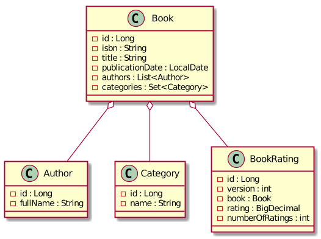
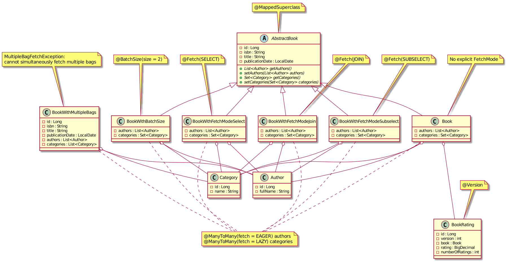
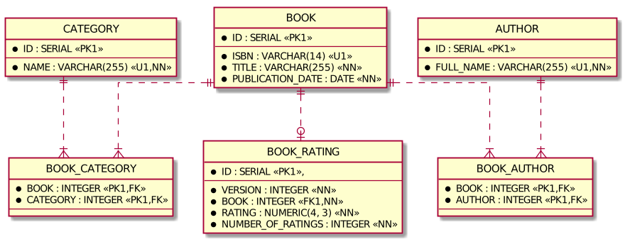

# Spring Data JPA Examples

An example of some complicated aspects of Spring Data JPA such as

* fetching strategies of `@OneToMany` and `@ManyToMany` collections
* locking strategies
* entity to DTO mapping

## Prerequisites

* JDK 11
* Docker at least 1.6.0

## How to run tests

To build project and run all tests use command

```bash
./gradlew cleanTest test -i
```

## Implementation details

* JDK 11
* Spring Boot 2.2.x
* Spring Data JPA 2.2.x
* [MapStruct](https://mapstruct.org/) 1.3.1.Final
* JUnit 5
* [Testcontainers](https://www.testcontainers.org/)

This example has a simple domain model. 
A book has at least one author and belongs to at least one category.
A book can be rated. An average rating and a total number of ratings are tracked. 

**Simplified UML class diagram**



Many-to-many relationship `List<Author> authors` has `javax.persistence.FetchType.EAGER` 
and many-to-many relationship `Set<Category> categories` has `javax.persistence.FetchType.LAZY`.

To demonstrate how different `org.hibernate.annotations.FetchMode`s work 
the hierarchy of book classes used:
* `com.example.spring.data.jpa.entity.AbstractBook` - `@MappedSuperclass`
* `com.example.spring.data.jpa.entity.Book` - no explicit `@Fetch`
* `com.example.spring.data.jpa.entity.BookWithFetchModeJoin` - `@Fetch(JOIN)`
* `com.example.spring.data.jpa.entity.BookWithFetchModeSelect` - `@Fetch(SELECT)`
* `com.example.spring.data.jpa.entity.BookWithFetchModeSubselect` - `@Fetch(SUBSELECT)`
* `com.example.spring.data.jpa.entity.BookWithBatchSize` - `@BatchSize`
* `com.example.spring.data.jpa.entity.BookWithMultipleBags` - doesn't extend `AbstractBook` and has `List<Category> categories` instead of Set<Category> like in `AbstractBook` and its children what leads to `MultipleBagFetchException: cannot simultaneously fetch multiple bags` when both relations are fetched using join.

To demonstrate locking strategies a `com.example.spring.data.jpa.entity.BookRating` class has `@Version int version` field.

**Actual UML class diagram**



**Entity-relationship diagram**



## Test cases

* Fetching strategies
  * Entity without explicit `@Fetch` - `com.example.spring.data.jpa.BookRepositoryTest`
    * `CrudRepository.findById`
    * Query method
    * Query method with `@EntityGraph`
    * Query method with `@EntityGraph` and `Pageable`
    * Query method with `@EntityGraph` with multiple attribute nodes (issue [HHH-13740](https://hibernate.atlassian.net/browse/HHH-13740))
    * `@Query` with JPQL `join fetch`
    * `@Query` with JPQL join fetch and distinct
    * Custom `@Repository` with Criteria API query
    * Custom `@Repository` with Criteria API query with `fetch`
    * Custom `@Repository` with Criteria API query with `fetch` and `distinct`
    * Mapping from entity to DTO using MapStruct
  * Entity with `@Fetch(JOIN)` - `com.example.spring.data.jpa.BookWithFetchModeJoinRepositoryTest`
    * `CrudRepository.findById`
    * Query method
  * Entity with `@Fetch(SELECT)` - `com.example.spring.data.jpa.BookWithFetchModeSelectRepositoryTest`
    * `CrudRepository.findById`
    * Query method
  * Entity with `@Fetch(SUBSELECT)` - `com.example.spring.data.jpa.BookWithFetchModeSubselectRepositoryTest`
    * `CrudRepository.findById`
    * Query method
  * Entity with `@BatchSize` - `com.example.spring.data.jpa.BookWithBatchSizeRepositoryTest`
    * `CrudRepository.findById`
    * Query method
  * Entity with multiple bags (two `@ManyToMany` collections with type `List`) resulting in `MultipleBagFetchException` - `com.example.spring.data.jpa.BookWithMultipleBagsRepositoryTest`
* Locking strategies - `com.example.spring.data.jpa.BookRatingRepositoryTest`
  * Implicit optimistic lock of entity with `@Version` on modification
  * Explicit optimistic lock `@Lock(OPTIMISTIC)`
  * Explicit optimistic lock `@Lock(OPTIMISTIC_FORCE_INCREMENT)`
  * Explicit pessimistic write lock `@Lock(PESSIMISTIC_WRITE)`
  * Explicit pessimistic read lock `@Lock(PESSIMISTIC_READ)`
